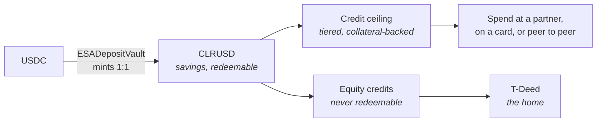
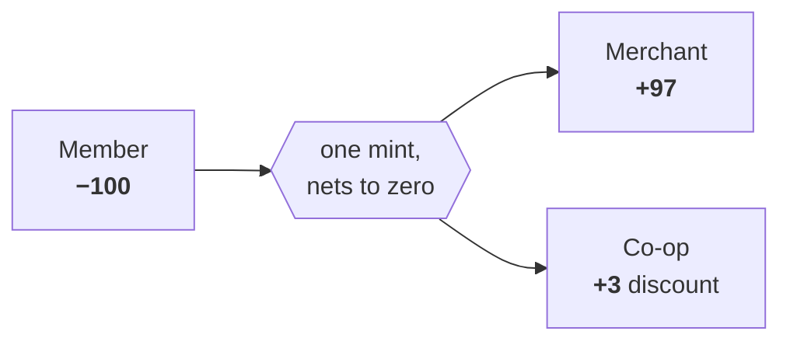
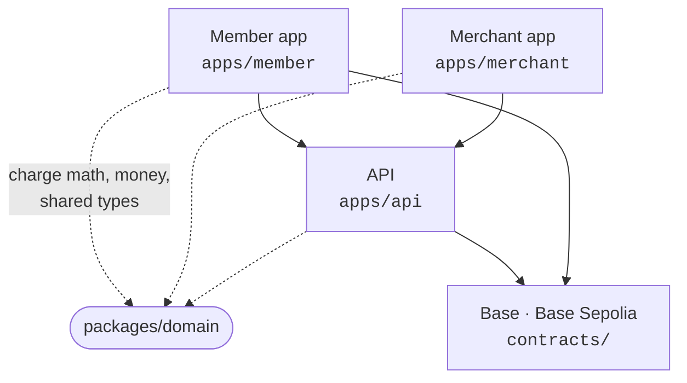
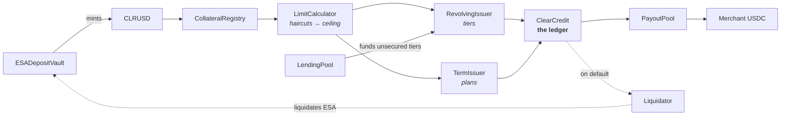
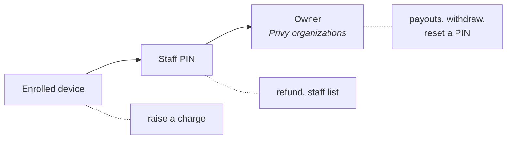

# Clear

Monorepo for **CLEAR** — a fintech app and financial co-op built to turn renters into owners — and
for its **Deed track**, the open-source real-world-asset layer underneath it.

Four deployable things and one chain: the Solidity protocol, a consumer app, a merchant counter
app, and the API both apps talk to.

[System](#what-the-system-is) · [Layout](#repository-layout) · [Quickstart](#quickstart) ·
[Contracts](#the-on-chain-layer) · [Addresses](#deployed-addresses) · [Tooling](#contract-tooling) ·
[API](#the-api-appsapi) · [Member](#the-member-app-appsmember) · [Merchant](#the-merchant-app-appsmerchant) ·
[Licensing](#licensing) · [Docs](#documentation)

> ⚠️ **Status: alpha, developer preview.** The contracts are deployed on Base Sepolia and partly on
> Base, and they are **unaudited**. Interfaces still move. Do not put real money behind them without
> an independent security review and operational hardening.

---

## What the system is

Deposit USDC, get CLRUSD 1:1 — liquid savings, redeemable any time. That balance backs a credit
line and, separately, accrues **equity credits** that can only ever be spent on a home. Members pay
partner merchants, tap a Clear card, or send to each other. The home itself is a T-Deed.



Two mechanics to know before reading the contract code.

**CLRUSD and the credit ledger are separate tokens, deliberately.** CLRUSD is money, fully reserved
against deposited USDC. `ClearCredit` is a signed per-member balance — an obligation ledger, not a
pot of money. Merge them and CLRUSD is backed partly by USDC and partly by somebody's promise.

**A purchase is a three-party mint that nets to zero.** Nobody lends anything at origination, so
origination is capital-free. Liquidity is needed only at redemption, when a merchant converts a
positive balance to USDC.



Both are argued out in [`docs/contracts/clear-contracts-build-plan.md`](./docs/contracts/clear-contracts-build-plan.md).

---

## Repository layout

npm workspaces + Turborepo. Each app under `apps/` is its own deploy target with its own root
directory.

```
apps/
  member/           consumer PWA           @clear/member     Vite + React 19
  merchant/         counter app            @clear/merchant   Vite + React 19
  api/              Express on Bun         @clear/api        Docker → Railway
packages/
  domain/           charge lifecycle, split + carry math, money formatting, shared types
  tokens/           color, type scale, spacing, radii
  contracts-sdk/    generated ABIs, addresses and read helpers — generated output only
contracts/          Solidity (AGPL-3.0 — see NOTICE.md)
deploy/             numbered Hardhat deploy scripts, upgrade + verification tooling
deployments/        deployed addresses and ABIs, by network
scripts/            operational scripts — role grants, upgrades, registry configuration
test/               Hardhat suites
docs/               protocol docs, contract build plans, UX specs, integration specs
```

### One state machine, two ends

The merchant's "waiting" screen is the member's approval screen, unopened. Anything both must agree
on is computed once in `packages/domain` — which is why the reference figures live there as unit
tests. **If the two apps ever disagree on a number for the same charge, that package is wrong.**



No shared component library, deliberately: a tablet counter app and a consumer phone app are
different products. Tokens and formatters are the whole shared design surface.

### Deploy targets

| Target | Root directory | Host |
|---|---|---|
| member | `apps/member` | `useclear.org` |
| merchant | `apps/merchant` | `merchants.useclear.org` |
| api | `apps/api` | Railway (Docker) |

**Auth sessions do not cross the two surfaces.** Different auth models, no cookie scoped to
`.useclear.org`, neither app reads the other's storage.

> Vercel's root directory is a dashboard setting, not a repo file. Merchant builds from the
> workspace root (`apps/merchant/vercel.json`); member's root must point at `apps/member`.

---

## Quickstart

Requires **Node ≥ 20.19**. The API runs on **Bun**.

```bash
npm install          # installs the whole workspace from the repo root
cp .env.example .env # RPC URLs + deployer key for Hardhat
npm run compile
npm run test
```

Then run whichever surface you need:

```bash
npm run dev --workspace @clear/member     # http://localhost:5173
npm run dev --workspace @clear/merchant   # http://localhost:5174
cd apps/api && cp env.example .env && npm run dev   # http://localhost:3001
```

Turborepo drives everything across the workspace:

```bash
npm run build        # turbo run build
npm run typecheck
npm run lint
npm run test:apps
npm run build:member # or build:merchant, filtered
```

`.claude/launch.json` carries dev-server definitions for the two apps.

---

## The on-chain layer

### Deed track — real-world assets

| Contract | Role |
|---|---|
| `DeedNFT.sol` | Upgradeable ERC-721 T-Deed with trait storage and transfer policy controls |
| `Validator.sol` | Validation criteria, service fees, token whitelist, royalties, agreement handling |
| `ValidatorRegistry.sol` | Validator registration, status, role propagation |
| `FundManager.sol` | Validator fee accounting, commission routing, T-Deed compatibility |
| `MetadataRenderer.sol` | Trait-aware metadata, document and feature composition |
| `Subdivide.sol` | ERC-1155 units for Land/Estate subdivision, with unit-level validation |
| `Fractionalize.sol` + `FractionToken.sol` + `FractionTokenFactory.sol` | Asset lock/unlock and clone-deployed ERC-20 shares |

### Money — savings and settlement

| Contract | Role |
|---|---|
| `ClearUSD.sol` / `ClearUSDUpgradeable.sol` | CLRUSD, 6 decimals, Chainlink burn/mint ERC-20 (the upgradeable one is UUPS) |
| `ESADepositVault.sol` | The Equity Savings Account: USDC in, CLRUSD out 1:1, redeemable |
| `SavingsIntentFactory.sol` / `SavingsIntentEscrow.sol` | Gasless deposit intents, relayer-settled |
| `ClaimEscrow.sol` | USDC escrow for link-based send: sender lock, settler claim, expiry refund |

### Credit

**The waterfall is not four accounts — it is one balance with a tiered ceiling.** `ClearCredit`
answers what the balance and the ceiling are; the issuers answer what the ceiling is made of.



| Contract | Role |
|---|---|
| `ClearCredit.sol` | The deployable ledger — the concrete form of `StableCredit` / `MutualCredit` |
| `CreditIssuer.sol` | Base underwriting: periods, compliance, default and write-off controls |
| `RevolvingIssuer.sol` | The tiered line — savings, asset, income, Boost. Cheapest-first, one carry index per tier |
| `TermIssuer.sol` | Term plans — partner credit, Clear Cash, ELPA. Per-position rate and clock, split schedules |
| `CollateralRegistry.sol` | What each member has pledged, and where it sits |
| `LimitCalculator.sol` | Values collateral, applies haircuts, emits the tiered ceiling |
| `LendingPool.sol` | ERC-4626, utilization-priced. Funds the unsecured tiers |
| `Liquidator.sol` | Fires ESA liquidation on default, before anything becomes lost debt |
| `CreditPool.sol` | Queued deposit/withdraw with discount-rate servicing |
| `AccessManager.sol` | Admin / operator / member authority boundaries |
| `MembershipRegistry.sol`, `NetworkRegistry.sol` | Membership, and member → issuers → (credit, pool, oracle) |

> Two credit lines, and confusing them breaks approvals. `TermIssuer.termLimitOf` is the ceiling a
> **split plan** draws against, underwritten off-chain against attested income. The **revolving
> tiers** are a different line, backed by pledged collateral. Summing tiers to quote a plan promises
> room the plan cannot use.

### Merchant settlement

| Contract | Role |
|---|---|
| `MerchantRegistry.sol` | Per-merchant terms: payout schedule, approval cap, discount rate, status |
| `PayoutPool.sol` | Funds merchant redemptions at par, separately from the AssurancePool, and reports its own shortfall |

A merchant's positive balance **is** the payables ledger — what the co-op owes them, on-chain, with
no parallel off-chain record. A merchant carrying credit of their own is paid by drawdown first;
only the surplus is redeemable.

### Reserve, pricing and bonds

| Contract | Role |
|---|---|
| `AssurancePool.sol` | Primary / buffer / excess reserve accounting and conversion paths |
| `AssuranceOracle.sol` | Uniswap V3 pricing with registry fallback, and RTD inputs |
| `TokenRegistry.sol` | Token registry, stablecoin metadata, chain mappings, fallback pricing |
| `BurnerBond.sol`, `BurnerBondDeposit.sol`, `BurnerBondFactory.sol` | ERC-1155 zero-coupon bond collections with curve-based discount mechanics |
| `BondVault.sol`, `BondValuer.sol`, `BondTraits.sol`, `BondDiscountCurve.sol` | Per-bond accounting, code-enforced redemption reserve, valuation and curve |

### Libraries

`CarryIndex` (lazy accrual — carry is derived on read, never by iterating accounts), `ExposureMath`,
`JSONUtils`, `StringUtils`, `TickMath`.

### Standards and patterns

- ERC-721, ERC-1155, ERC-20, ERC-2981, ERC-4626
- UUPS and transparent proxies where applicable; `.openzeppelin/` tracks the upgradeable ones
- RBAC, pausability, reentrancy protection on every value-moving path
- Trait-driven metadata with structured document and feature fields

---

## Deployed addresses

Artifacts live in `deployments/<network>/<Contract>.json` alongside their ABIs.

<details>
<summary><b>Base Sepolia</b> — the working network (35 contracts)</summary>


| Contract | Address |
|---|---|
| ClearCredit | `0x1d9f1ECDc70b31256aFA75A73F991cfAa8bC928C` |
| RevolvingIssuer | `0x7f15E45aB5eAF0307200274211a90FcbD6716070` |
| TermIssuer | `0xe467d87756FDF9645D751485CDB72A1E14683721` |
| CollateralRegistry | `0x62fBdf62Ad0C3f52d898b28b2d1FB31e9EB152Cf` |
| LimitCalculator | `0xbA9880F46128027D39F7694e3cfdf077D716c0a7` |
| LendingPool | `0x58405326b66888d8a9f2Dc4646cAc2F5EaC7ce23` |
| Liquidator | `0x8E2E075F6d985cfd21F5732D4D080b01Bbb89593` |
| MerchantRegistry | `0x4172842Ab5B1675a9E7F65B4eAcb2CC3f6b2f1f5` |
| PayoutPool | `0xe9d1bb0cbDFf7e1Ef8Ff30104C21318c3Bca7D66` |
| NetworkRegistry | `0x0a9FE081622d41069DF22898D969F13e65783D7f` |
| MembershipRegistry | `0xE7009eE28a71d8D593Cb57C48E1e648A9fB44dE8` |
| AccessManager | `0x19aBfD8aC2015743238a85F849873870fEDcf207` |
| AssurancePool | `0xf5E40414410672636Ab1691ae19D2Aa1c1705840` |
| AssuranceOracle | `0x2E5241bE8d35a0034aF5C6538ABd683655c2Fe38` |
| TokenRegistry | `0x4B13b49167941d128DB56008AdfDac805f868a86` |
| ClearUSD | `0x56195066D4ada8D371254061047f76FA2BBd0Ae3` |
| ClearUSDUpgradeable | `0x2a116Bead17dd96DC5c560A0d76b02eb2D7aD6D1` |
| CLRUSDTokenPool | `0xd8a171c293969E8b97EFE1a9dA7742205e23CCc1` |
| ESADepositVault | `0x836401Ed3e2bF7CAb5e2721188E74B834511413b` |
| SavingsIntentFactory | `0xee289AF20ddf5654E688ABDEa45D0d741528C8Bc` |
| ClaimEscrow | `0x24DAE7b66dC31657265260B5d9092280B57Bc37D` |
| BurnerBondFactory | `0x77e261F967491100906a607b8E46eD670684edDb` |
| BurnerBond | `0x4d96904EA80aae8cAC34826f8Fd0aF52Ae85c148` |
| BurnerBondDeposit | `0x1933aC0BDd58C1a6D48c19f8A7fD96c5Ec27c6C3` |
| BondVault | `0x9f311Fd8F05Ed517130dC044cDdBb159d02bA855` |
| BondValuer | `0x64d509b34B7088C51594002eB5624f63b7630d2C` |
| DeedNFT | `0x1a4e89225015200f70e5a06f766399a3de6e21E6` |
| Validator | `0x18C53C0D046f98322954f971c21125E4443c79b9` |
| ValidatorRegistry | `0x979E6cC741A8481f96739A996D06EcFb9BA2bc91` |
| FundManager | `0x73ea6B404E6B81E7Fe6B112605dD8661B52d401e` |
| MetadataRenderer | `0x849e13500658a789311923b86b0eB60a87C870E5` |
| Subdivide | `0x3c947D71cb1698dFd4D7551b87E17306865C923F` |
| Fractionalize | `0xeC464847C664Cc208478adbe377f7Db19e199823` |
| FractionTokenFactory | `0x3E513d3c3c2845B5cAc4FA5e21C0f7f80f9328dc` |
| Create2Deployer | `0x2BFba336A1B5E79E4717CA00677C65DDCa63cB06` |

`ESADepositVaultLegacy` and `RevolvingIssuerV1` are retained for reference; superseded.

</details>

<details>
<summary><b>Base</b> — savings and send rails only</summary>


| Contract | Address |
|---|---|
| ClearUSD | `0xa7a257f411e4Fe98e1D1FaA36C84B864c3336583` |
| ESADepositVault | `0x0CfE6aFB053474cE4Ff744a1fe864C82c173a1C1` |
| ClaimEscrow | `0xb30E97FEd437bf89B122693D26338C8D64515096` |
| Create2Deployer | `0xF313b7b748691e778cAaBD1dDF8e8dca7bD33c21` |

</details>

<details>
<summary><b>Ethereum Sepolia</b> — CLRUSD cross-chain only</summary>


| Contract | Address |
|---|---|
| ClearUSD | `0x54Dd3449Eb54adC02C33cD880178BfA718991753` |
| CLRUSDTokenPool | `0x7ec282D0501407f52ce2099BFa5d76AAc1f4890d` |
| Create2Deployer | `0xc54dA54b0BDa1BAfE279cc61Ade42ac73A6D2023` |

</details>

The credit stack is **not** on mainnet. Base carries the savings and send rails only.

---

## Contract tooling

### Tests

```bash
npm run test              # everything
npm run test:core         # test/core
npm run test:esa-vault    # a single suite
npm run test:coverage
npm run test:gas
```

| Area | Suites |
|---|---|
| Deed track | `DeedNFT`, `Validator`, `ValidatorRegistry`, `FundManager`, `MetadataRenderer` |
| Credit | `StableCredit`, `StableCreditIssuers`, `RevolvingIssuer`, `TermIssuer`, `LimitCalculator`, `CollateralRegistry`, `LendingPool`, `Liquidator`, `PayoutPool` |
| Credit invariants | seniority, first-loss ordering, repayment routing, income-to-debt, asset-backed default |
| Savings + settlement | `ESADepositVault`, `SavingsIntentFactory`, `ClearUSDUpgradeable`, `ClaimEscrow` |
| Bonds | `BurnerBond`, `BondVault`, `BondCollateral` |
| Reserve | `AssurancePool`, `AssuranceOracle` |
| Libraries | `CarryIndex`, `ExposureMath` |

### Deployment

The `deploy/` scripts are numbered and run in order; `deploy/deploy_all.ts` walks the Deed track.

```bash
npx hardhat run deploy/deploy_all.ts --network base-sepolia   # Deed track

npm run deploy:token-registry     -- base-sepolia
npm run deploy:assurance-pool     -- base-sepolia
npm run deploy:assurance-oracle   -- base-sepolia
npm run deploy:burner-bonds:sepolia
npm run deploy:clrusd             -- base-sepolia
npm run deploy:esa-vault          -- base-sepolia
npm run deploy:clrusd-register    -- base-sepolia
npm run deploy:clrusd-pool        -- base-sepolia
npm run deploy:access-manager     -- base-sepolia
npm run deploy:membership-registry -- base-sepolia
npm run configure:membership-registry -- base-sepolia
npm run deploy:savings-intents    -- base-sepolia

npx hardhat run deploy/11_deploy_ClaimEscrow.ts       --network base-sepolia
npx hardhat run deploy/20_deploy_CreditCore.ts        --network base-sepolia
npx hardhat run deploy/21_deploy_ClearUSDUpgradeable.ts --network base-sepolia
npx hardhat run deploy/22_deploy_BondsAndPool.ts      --network base-sepolia
npx hardhat run deploy/23_deploy_BondCollection.ts    --network base-sepolia
```

Runbooks: [`deploy/README.md`](./deploy/README.md),
[`deploy/DEPLOYMENT_GUIDE.md`](./deploy/DEPLOYMENT_GUIDE.md),
[`docs/contracts/clear-deployment-plan.md`](./docs/contracts/clear-deployment-plan.md).

### Verification and upgrades

```bash
npm run verify:deployments:sepolia
npm run verify:deployments -- base
npm run upgrade:check   -- base-sepolia
npm run upgrade:execute -- base-sepolia
```

### Operational scripts

```bash
npm run send:grant-settler:base-sepolia          # ClaimEscrow settler role
npm run clrusd:ccip:configure -- base-sepolia    # CCIP lanes for CLRUSD
npm run clrusd:validate       -- base-sepolia
npx hardhat run scripts/grant_collateral_operator.ts --network base-sepolia
npx hardhat run scripts/rotate_credit_operator.ts    --network base-sepolia
npx hardhat run scripts/register_merchant.ts         --network base-sepolia
npx hardhat run scripts/set_target_rtd.ts            --network base-sepolia
npx hardhat run scripts/sync_savings_collateral.ts   --network base-sepolia
```

Operator authority on the issuers is `stableCredit.access().isOperator(caller)` — an AccessManager
check two hops out, not a role on the issuer itself.

---

## The API (`apps/api`)

Express on Bun, Postgres, Redis, socket.io. Deployed as a Docker image on Railway; `render.yaml` and
`docker-compose.yml` are also checked in.

```bash
cd apps/api
cp env.example .env
npm run dev      # bun --watch src/index.ts
```

Route groups mounted in `apps/api/src/index.ts`:

| Group | What it covers |
|---|---|
| `/api/prices`, `/api/balances`, `/api/token-balances`, `/api/nfts`, `/api/transactions`, `/api/portfolio` | Chain data aggregation, caching, portfolio history + snapshots |
| `/api/members`, `/api/contacts`, `/api/avatars`, `/api/member-links`, `/api/notifications` | Member identity, profile, directory lookup, push |
| `/api/savings`, `/api/credit`, `/api/pay`, `/api/autopay`, `/api/requests` | ESA deposits, credit lines and plans, the equity ledger, autopay |
| `/api/send` | Link-based send: prepare, lock, claim, payout, refund |
| `/api/charges`, `/api/merchant`, `/api/withdraw` | Merchant charges, staff, payouts, refunds |
| `/api/cards`, `/api/lithic`, `/api/lithic/cards` | Card issuing, JIT auth decisioning, ACH origination |
| `/api/plaid`, `/api/bridge`, `/api/stripe`, `/api/onramper`, `/api/ramp`, `/api/sweeps` | Bank links, KYC, fiat on/off ramps, sweeps |
| `/api/webhooks/{lithic,bridge,onramper,coinbase-ramp}`, `/api/stripe/webhooks` | Signature-verified provider callbacks, mounted outside auth |

```text
GET /health
```

Most groups sit behind `requireAuth`; webhooks and a few public reads do not. Rate limiting is
Redis-backed, applied at `/api`.

| Provider | Owns |
|---|---|
| **Bridge** | Fiat → USDC deposits, hosted KYC |
| **Lithic** | Card issuing, JIT authorization, ACH push/pull |
| **Plaid** | Bank linking and identity |
| **Stripe** · **Coinbase** | Card and crypto on-ramps |

More: [`apps/api/README.md`](./apps/api/README.md), [`apps/api/DEPLOY.md`](./apps/api/DEPLOY.md),
[`docs/integrations/lithic-integration-spec.md`](./docs/integrations/lithic-integration-spec.md).

---

## The member app (`apps/member`)

React 19 + Vite + Tailwind, Radix primitives.

| Concern | Stack |
|---|---|
| Auth + wallets | **Privy** — embedded smart wallets, wagmi/viem underneath |
| Account abstraction | ZeroDev — sponsored gas, session keys |
| Messaging · Map | XMTP · Mapbox |
| Routing · On-ramp | LiFi · Stripe |

Routes:

| Route | Screen |
|---|---|
| `/` | Home |
| `/savings` | ESA — deposit, redeem, equity credits |
| `/earn` | Credit line, tiers, plans |
| `/send` | Send to a wallet, email or phone |
| `/activity` | Transactions across chain and linked banks |
| `/card` | The Clear card |
| `/scan`, `/c/:code` | Scan to pay, and charge approval |
| `/contacts`, `/partners`, `/assurance`, `/inbox`, `/settings`, `/learn/:topic` | The rest |
| `/login`, `/onboarding`, `/s/:shop`, `/claim/:token`, `/wallet-link`, `/share` | Unauthenticated entries |

`/s/:shop` is counter onboarding — a signup started at a merchant counter, which can never itself
authorize a charge. `/claim/:token` is the recipient side of a send link and needs no account.

### PWA

The member app is installable.

- **Manifest** — `public/manifest.json`: standalone display, shortcuts, share target
- **Service worker** — `public/sw.js`: per-route cache strategies, network-only for stateful
  endpoints such as Plaid
- **Runtime** — `OfflineIndicator`, `InstallPrompt`, `PWAInitializer` for sync + notification
  registration; helpers in `src/utils/serviceWorker.ts`

> **Bundle secrets are scanned on every build** (`npm run scan:secrets`). Dynamic
> `import.meta.env[key]` access inlines the entire `VITE_` namespace — so the scan is a build gate,
> not a lint.

---

## The merchant app (`apps/merchant`)

Staff raise financed charges at a counter; owners manage payouts, staff and refunds.

**Financed transactions only.** A member paying from their balance or tapping a Clear card runs on
ordinary payment rails and never appears here.



Owners can reset a PIN; staff cannot choose each other's. The two balances an owner sees — **owed**
and **held** — are different money and are never summed.

Screens: `/` counter, `/new`, `/charges` + detail + refund, `/payouts` + detail with the withdraw
modal, `/staff`, `/overview`, `/settings`, `/onboarding`.

Design reference: [`docs/ux/clear-merchant-app-reference.html`](./docs/ux/clear-merchant-app-reference.html).

---

## Licensing

This repository carries more than one license, and which applies depends on the directory.

| Directory | License | File |
|---|---|---|
| `contracts/`, `deploy/`, `scripts/`, `test/` | AGPL-3.0 | [`contracts/LICENSE`](./contracts/LICENSE) |
| `apps/member`, `apps/merchant`, `apps/api` | Proprietary — all rights reserved | [`LICENSE`](./LICENSE) |
| `packages/domain`, `packages/tokens`, `packages/contracts-sdk` | MIT | [`domain`](./packages/domain/LICENSE) · [`tokens`](./packages/tokens/LICENSE) · [`contracts-sdk`](./packages/contracts-sdk/LICENSE) |

`contracts/` is a fork of **StableCredit**, hence AGPL-3.0. **No application code imports Solidity
source from it** — the apps reach the chain through committed ABI JSON and, in future,
`packages/contracts-sdk`, which ships generated artifacts only. That rule is what keeps the copyleft
inside `contracts/`.

**Read [`NOTICE.md`](./NOTICE.md) before moving code across those boundaries.** It is the
authority on which license applies where, records the fork lineage file by file, and flags one
unsettled question: whether bindings generated from AGPL sources inherit the copyleft. The layout
here assumes they do not — that has not been reviewed by counsel, and should be before
`packages/contracts-sdk` is distributed outside Deed3Labs.

---

## Documentation

| | |
|---|---|
| Protocol index | [`docs/README.md`](./docs/README.md) |
| Contract build plan | [`docs/contracts/clear-contracts-build-plan.md`](./docs/contracts/clear-contracts-build-plan.md) |
| Deployment + wiring plan | [`docs/contracts/clear-deployment-plan.md`](./docs/contracts/clear-deployment-plan.md) |
| Deployment runbooks | [`deploy/README.md`](./deploy/README.md) |
| CLRUSD + ESA bootstrap | [`docs/clrusd-esa-bootstrap.md`](./docs/clrusd-esa-bootstrap.md) |
| Lithic integration | [`docs/integrations/lithic-integration-spec.md`](./docs/integrations/lithic-integration-spec.md) |
| App design spec | [`docs/ux/clear-app-design-spec.md`](./docs/ux/clear-app-design-spec.md) |
| Merchant reference | [`docs/ux/clear-merchant-app-reference.html`](./docs/ux/clear-merchant-app-reference.html) |
| Member overview | [`docs/CLEAR_MEMBER_OVERVIEW_2026.md`](./docs/CLEAR_MEMBER_OVERVIEW_2026.md) |
| Architecture | [`docs/architecture/`](./docs/architecture/) |
| Frontend | [`apps/member/README.md`](./apps/member/README.md) · Backend [`apps/api/README.md`](./apps/api/README.md) |

---

## Security

- Critical flows use role-based access control, pause controls and reentrancy protection
- Upgradeable modules require strict admin governance — multisig or equivalent
- Validate oracle, token registry, credit policy, merchant terms and settlement role assumptions
  before any production use
- Contracts are **unaudited**

---

## Contributing

Focused PRs against `dev`. Run the suites that cover what you touched, update the docs when an
interface or workflow moves, and re-validate the deploy and upgrade scripts whenever you change
contract initialization or permissions.
