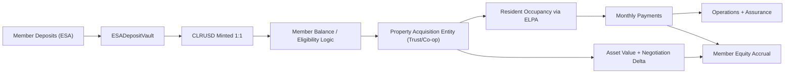

# CLEAR Investor Protocol Dossier (2026)

Prepared for: Investors, banks, financiers, and depositors  
Repository analyzed: `Protocol-Contracts`  
Analysis date: March 1, 2026

---

## 1. Purpose and Reader Positioning

This dossier explains CLEAR as a sustainable fintech/neobank/financial co-op model, grounded in:

1. The actual repository code, tests, deployments, and docs.
2. The strategic narrative and product framing provided by the founding team.

This is written to withstand institutional diligence. It deliberately separates:

- What is already implemented in code.
- What exists as product UX or marketing narrative.
- What is a legal/operational roadmap item.

---

## 2. Core Narrative and Market Position

### Mission

- `Turning Renters into Owners`.
- `Stop Renting. Start Owning. Take the CLEAR path.`

### Narrative thesis

> `We don't just hold your money; we use our collective power to buy the neighborhood, then we give the keys to you.`

### Strategic identity (2026 framing)

CLEAR is positioned as a:

1. Fintech app.
2. Depositor-owned neobank / financial co-op.
3. Real-asset operating system that combines acquisition, residency, equity accrual, and collateral protection.
4. Unified CLEAR stack where T-Deeds contracts digitize and structure RWA real-estate rights.

### Product family (target brand architecture)

1. `Clear Savings` (ESA: Equity Savings Account).
2. `Clear Equity` (ELPA: Equity-Lease Participation Agreement).
3. `Clear USD ($CLRUSD)` stable settlement token.
4. `Clear Assurance` (collateral protection + maintenance ops).
5. `Clear Credit` (credit and servicing primitives).
6. Optional investor product: local yield fund.

---

## 3. Repository Reality Check: What Exists Today

### Repo size and breadth

- `contracts/`: 51 Solidity files.
- `docs/`: 32 docs.
- `test/`: 19 files.
- `app/src/`: 186 frontend files.
- `app/server/src/`: 39 backend files.

### Current technical maturity statement from repo

The root `README.md` explicitly marks the protocol as:

- `Alpha (Developer Preview)`
- `unaudited`
- `interfaces may change`

This is critical for investor communications: production readiness is not yet claimed in core docs.

### Implemented system layers (code)

1. RWA tokenization and validation (`T-Deeds`, `Validator`, `ValidatorRegistry`, `FundManager`, `MetadataRenderer`).
2. Asset structuring (`Subdivide`, `Fractionalize`, `FractionTokenFactory`).
3. Reserve and pricing (`AssurancePool`, `AssuranceOracle`, `TokenRegistry`).
4. Credit rails (`StableCredit`, `MutualCredit`, `CreditIssuer`, `CreditPool`, `AccessManager`).
5. Settlement rails (`ClaimEscrow`).
6. Stablecoin + vault rails (`ClearUSD`, `ESADepositVault`).
7. Bond market rails (`BurnerBondFactory`, `BurnerBondDeposit`, `BurnerBond`).

### CLEAR-specific implementation footprint today

- CLEAR/ELPA language appears in frontend product copy and UX logic (`app/src/components/portfolio/SavingsHome.tsx`).
- `ClearUSD` and `ESADepositVault` are implemented on-chain and documented.
- No dedicated on-chain `ELPA` contract is present in this repository as of March 1, 2026.
- T-Deeds contracts encode beneficiary ownership state and update beneficiary on transfer.
- Trust/legal clauses (assumption clause, residual beneficiary clause, trustee/protector actions) are still legal-process workflows, not fully automated contract modules in this repo.

---

## 4. CLEAR Business Model in Institutional Terms

### 4.1 Business model summary

CLEAR is a vertically integrated ownership platform:

1. Capital aggregation via member deposits.
2. Home acquisition via principal buying entity (trust/co-op structure).
3. Occupancy under a structured residency contract (ELPA).
4. Monthly cash flows split between occupancy economics, equity accrual, and portfolio maintenance.
5. Appreciation sharing and transferability mechanics.
6. Optional external investor capital via local yield product.

### 4.2 Why this is different from mortgage and renting

Traditional rent:

- 0 resident equity accrual.
- No participation in negotiated acquisition edge.
- Resident bears rising rents without long-term ownership path.

Traditional mortgage:

- High down payment and credit gate.
- Interest-heavy amortization early in term.
- Frictional exits and refinancing dependency.

CLEAR (target model):

- Low initial out-of-pocket entry (`2%` target policy).
- Equity-linked monthly flow.
- Equity portability / transferable beneficial interest structure.
- Co-op alignment: lower acquisition price directly increases member starting equity.

---

## 5. Product Stack: Implemented vs Planned

### 5.1 Clear USD (`$CLRUSD`) - Implemented

Contract: `contracts/peripherals/ClearUSD.sol`

- 6-decimal token via Chainlink `BurnMintERC20` base.
- Explicit admin and mint/burn role controls.
- Designed for CCIP burn/mint pool integrations.

Institutional interpretation:

- Settlement unit for program flows.
- Governance-critical role model for issuance controls.

### 5.2 Clear Savings (ESA) - Implemented Core, Product Layer in Progress

Contract: `contracts/peripherals/ESADepositVault.sol`

- Isolated mint/redeem vault with exact conversion checks.
- Supports allowlisted deposit tokens.
- Pause controls and role gating.
- 1:1 mint/redemption logic by decimals with non-exact conversion reverts.

Runbook: `docs/clrusd-esa-bootstrap.md`

- Explicitly states v1 segregation from `AssurancePool`.

Institutional interpretation:

- Clean liability-reserve perimeter for early phase.
- Strongly auditable collateral path if operations are disciplined.

### 5.3 Clear Equity (ELPA) - Strategic Product Layer, Not Yet Contract-Codified Here

Current state:

- ELPA is present in frontend copy and member journey UX framing.
- No dedicated Solidity ELPA lifecycle contract currently in repo.
- T-Deeds and validator stack already track ownership/beneficiary traits and transfer-linked state updates.

Implication:

- The legal contract and trust-administration lifecycle should be presented as a hybrid model: key ownership state on-chain, legal administration workflows in signed agreements and operations.

### 5.4 Clear Assurance - Concept + Partial Technical Foundation

Technical anchors in repo:

- `AssurancePool` reserve architecture.
- `AssuranceOracle` pricing and RTD target logic.
- Extensive docs around reserve flows.

Operational assurance claims in your narrative:

- `$0` service calls for major systems.
- One-tap repair orchestration.
- Collateral-preserving maintenance with digital logs.

Gap:

- Home repair dispatch/contractor network economics are operational playbooks, not fully encoded on-chain workflows.

### 5.5 Clear Credit - Implemented Primitive Layer

Contracts:

- `StableCredit`, `MutualCredit`, `CreditIssuer`, `CreditPool`, `AccessManager`.

Capabilities:

- Credit lines, limits, periods, grace/default logic, write-offs, and reserve reimbursement hooks.

Institutional interpretation:

- A mature credit primitive foundation exists.
- Product packaging for consumer housing finance requires policy/legal overlays and risk operations.

---

## 6. Capital and Value Flows

### 6.1 Acquisition edge logic (from your model)

You define an `Equity Offset` model where down payment remains fixed at `2%` and starting equity is adjusted by negotiated execution vs appraisal.

Illustrative structure:

1. Standard: appraisal = purchase, base starting equity.
2. Win: purchase below appraisal, negotiation spread credited to member equity.
3. Premium: purchase above appraisal, premium debits starting equity stake.

Institutional framing:

- This is a transparent value-transfer policy.
- It creates measurable alignment between acquisition desk performance and member wealth outcomes.

### 6.2 Revenue stack candidates (sustainable model)

Potential revenue components (some implemented, some operationally planned):

1. Protocol service fees and commissions (`FundManager` commission architecture).
2. Validator/royalty economics (existing in tokenization rails).
3. Acquisition/operations spread (negotiated vendor and maintenance economics).
4. Assurance management spread (cost efficiency from contractor network scale).
5. Funding spread from investor capital products.
6. Platform fees on transfer/assumption workflows.

---

## 7. Unit Economics Framework for a Single Home

Use this as investor memo format template.

### Inputs

1. Target home price.
2. Appraised value.
3. Negotiated purchase value.
4. Member entry deposit (2% policy target).
5. Co-op/member match policy (1:1 program).
6. Monthly occupancy payment.
7. Maintenance reserve contribution.
8. Insurance/taxes carrying cost.
9. Cost of capital / trust financing cost.

### Derived metrics

1. Day-1 member equity.
2. Deal delta credit/debit.
3. Monthly equity accrual rate.
4. Gross asset yield.
5. Net operating margin after assurance + capex reserve.
6. Expected loss under delinquency scenarios.
7. Equity IRR for member and platform.

### Investor KPI examples

1. Acquisition discount vs appraisal (bps).
2. Loss-adjusted yield.
3. Delinquency and cure rate.
4. Average repair response time.
5. Collateral health score trend.
6. Member retention and move-with-equity frequency.

---

## 8. Governance, Controls, and Security Architecture

### 8.1 On-chain controls present

1. RBAC across critical modules.
2. Pause controls in vault and other upgradeable modules.
3. Reentrancy guards in financial pathways.
4. Token allowlists and registry centralization.
5. Oracle fallback framework.
6. UUPS upgradeability for selected core contracts.

### 8.2 Economic controls present

1. `FundManager` commission cap guard (`<=10%`).
2. Validator royalty cap guard (`<=5%`).
3. ESA vault exact-conversion checks to prevent rounding slippage.
4. Reserve-to-debt target management in assurance stack.

### 8.3 Governance design expectation for institutional acceptance

Required upgrades before large-scale capital intake:

1. Multisig + timelock control over admin roles.
2. Segregated authority matrix for issuance, pricing, and reserve movement.
3. Third-party audit reports for critical contracts.
4. Formal incident response and key compromise playbooks.

---

## 9. Testing and Reliability Snapshot (as executed March 1, 2026)

### 9.1 Core suite

Command: `npm run test:core`

Results:

- 177 passing.
- 6 failing.

Failure concentration:

1. `AssuranceOracle.spec.ts`: constructor argument mismatch vs current contract signature.
2. `MetadataRenderer.spec.ts`: event assertion drift and metadata expectation mismatch.

Interpretation:

- Core tokenization, validator, registry, and fund-manager behavior shows strong pass coverage.
- Some tests are out of sync with implementation, which is common in active alpha repositories but must be tightened pre-institutional deployment.

### 9.2 ESA/CLRUSD

Command: `npm run test:esa-vault`

Results:

- 8 passing.
- 0 failing.

Highlights:

- Role-gated mint/burn verified.
- 1:1 deposit/redeem behavior verified.
- Decimal exactness and pause controls verified.
- Basic solvency invariant covered.

### 9.3 ClaimEscrow

Command: `npx hardhat test test/peripherals/ClaimEscrow.spec.ts`

Results:

- 3 passing.
- 3 failing.

Failure pattern:

- Revert reason expectation mismatches and one transfer setup path reverting without inferred reason in test harness.

Interpretation:

- Settlement flow works in part but needs test and/or implementation alignment before being treated as production-grade payout infrastructure.

### 9.4 Build warnings observed

Hardhat emitted contract size warnings for:

1. `BurnerBondFactory.sol`
2. `ValidatorFactory.sol`

These exceed the classic 24KB runtime-code heuristic and can affect some deployment environments or optimization strategy decisions.

---

## 10. Deployment and Environment Posture

### 10.1 Deployment artifacts observed

Networks with saved artifacts:

1. `deployments/base-sepolia/` (core stack + CLRUSD + ESA vault).
2. `deployments/sepolia/` (partial CLRUSD-related artifacts).

### 10.2 Notable consistency issue

Base Sepolia `MetadataRenderer` address differs between:

1. Deployment artifact JSON.
2. Frontend/server static network config.

Institutional implication:

- Environment drift risk.
- Must enforce single-source deployment address management before production launch.

### 10.3 Artifact metadata quality issue

Observed deployment JSON `blockNumber` fields are `0` across sampled files.

Institutional implication:

- Weak forensic traceability for audits.
- Deployment pipeline should persist full chain receipts and deterministic release manifests.

---

## 11. CLEAR Legal/Structure Blueprint (from Provided Context)

This section captures your intended legal-operating architecture for ELPA and trust portability.

### 11.1 ELPA positioning

`Equity-Lease Participation Agreement` as an asset-backed residency contract with equity accrual mechanics.

### 11.2 Transferable beneficial interest clause (proposed)

Objective:

- Allow successor assumption of trust structure subject to re-appraisal and admin fee.
- Enable original occupant equity liquidation without mandatory third-party mortgage exit.

### 11.3 Residual beneficiary clause (proposed)

Objective:

- Preserve a 1% beneficial interest for contributor/seller until mortgage satisfaction or trust protector dissolution authorization.

### 11.4 Institutional caution

These are legal constructs and must be validated by counsel across:

1. Consumer finance regulation.
2. State real estate/landlord-tenant law.
3. Securities and investment offering rules.
4. Trust and bankruptcy remoteness treatment.

### 11.5 Legal-framework context for current CLEAR operations

Current CLEAR legal-operating packaging is supported by CLEAR documentation and founder-confirmed model choices:

1. Property-wrapper strategy based on individual property trusts.
2. Each property trust has a trustee and trust protector.
3. Identity-verification expectations (KYC/KYB for users and organizations).
4. Structured dispute-resolution process.
5. Traditional legal agreements (purchase, lease, trust/admin and related docs).
6. Third-party professional services for legal, property, and operational functions.

### 11.6 Organizational and capital-markets architecture

The operating architecture and provided entity chart indicate a broad platform scope including:

1. Parent/holding governance structure.
2. Dedicated protocol/R&D operating entity.
3. Property/title administration layer.
4. Trust/SPV pathways for property ownership and transfer.
5. 1031/721-UPREIT and REIT-style structuring pathways for institutional expansion.

Institutional use:

- Treat this as the active architecture map for diligence.
- Convert it to a dated current entity chart, legal memo set, and securities/compliance position before institutional scale.

---

## 12. Business Sustainability Thesis

### 12.1 Why model can be durable if executed correctly

1. Structural alignment: acquisition savings credited to members increases trust and retention.
2. Collateral-preserving maintenance improves loss given default and recovery outcomes.
3. Integrated rails (savings, settlement, reserve, credit) reduce operational fragmentation.
4. Community ownership narrative can create lower CAC and higher referral efficiency in a local market.

### 12.2 Sustainability hinges

1. Cost of capital discipline.
2. Delinquency management and underwriting quality.
3. Repair network execution quality.
4. Legal enforceability of ELPA and trust transfers.
5. Governance hardening and audit quality.

---

## 13. Inland Empire Go-To-Market Logic

Your IE-focused strategy is coherent for phased rollout:

1. Dense local operational network reduces maintenance latency and cost variance.
2. Standardized housing stock can improve repair playbook efficiency.
3. Repeated transaction geography increases acquisition execution learning.

Institutional recommendation:

- Launch with constrained geo scope and strict cohort controls.
- Prove repeatable unit economics before expanding counties/metros.

---

## 14. Messaging Architecture for Investor and Depositor Audiences

### 14.1 Depositor framing

- `Your deposits are not passively warehoused; they are programmatically directed toward local ownership outcomes.`
- `You are not just a customer; you are a member-owner in a cooperative capital model.`

### 14.2 Resident/member framing

- `Stop Renting. Start Owning. Take the CLEAR path.`
- `2% down target, equity accrual by design, and transparent deal economics.`

### 14.3 Capital-provider framing

- `Asset-backed local housing exposure with transparent reserve and servicing rails.`
- `Operationally integrated platform where acquisition, maintenance, and cash flow data support risk pricing.`

---

## 15. Critical Gaps to Close Before Institutional Scale

### 15.1 Product/legal gaps

1. ELPA smart-contract integration or robust off-chain legal orchestration layer with verifiable state synchronization.
2. Formal trust administration and transfer workflow tooling.
3. Full consumer compliance architecture (KYC/AML, disclosures, fair lending equivalents as applicable).

### 15.2 Engineering gaps

1. Resolve failing tests and stabilize CI signal quality.
2. Eliminate deployment config/address drift across frontend/server/deployment artifacts.
3. Improve deployment metadata completeness (real block numbers, tx hashes, manifests).
4. Complete coverage for BurnerBond stack and newer peripherals in automated tests.

### 15.3 Governance/risk gaps

1. Independent audits and threat modeling.
2. Multi-sig + timelock across privileged operations.
3. Operational SLAs and reserve policy disclosure pack.

---

## 16. 3-Phase Institutionalization Roadmap

### Phase 1 (0-6 months): Credibility and Controls

1. Fix failing test suites and freeze interface baseline.
2. Audit CLRUSD + ESA vault + core reserve/settlement components.
3. Implement release manifesting and deployment attestation.
4. Publish risk dashboard with reserve, delinquency, and maintenance KPIs.

### Phase 2 (6-12 months): Product-Legal Convergence

1. Production ELPA operating framework (contract package + data model).
2. Transferable beneficial interest workflow (documented and tested).
3. Assurance operating stack instrumentation (SLA logs, cost analytics, collateral health scoring).
4. Investor portal reporting standardization.

### Phase 3 (12-24 months): Capital Expansion

1. Structured funding program for local acquisition scale.
2. Secondary participation/assumption channel rollout.
3. Multi-region rollout only after IE cohort meets risk-adjusted KPI thresholds.

---

## 17. Investor Due-Diligence Checklist

### Corporate and legal

1. Entity chart and co-op/trust governance docs.
2. ELPA form agreements and state-by-state legal memos.
3. Consumer disclosure and servicing compliance package.

### Technical

1. Audit reports and remediation logs.
2. Privileged role matrix and key ceremony records.
3. Test coverage report and change-management process.

### Financial and risk

1. Cohort-level home economics and delinquency curves.
2. Reserve policy and stress scenarios.
3. Maintenance SLA and cost variance reports.
4. Asset-level collateral health scores and servicing histories.

---

## 18. Suggested External-Facing Positioning (Institutional-Safe Version)

`CLEAR is a fintech housing co-op platform that combines member deposits, asset-backed settlement rails, and local property operations to convert renters into owners. Our protocol layer includes stable settlement (CLRUSD), an ESA vault with exact 1:1 mint/redeem controls, reserve and credit primitives, and transparent governance pathways. Our ELPA residency model and trust framework are designed to align acquisition performance with member equity from day one.`

---

## 19. Appendix A - Implemented Contract Map (Selected)

Core:

- `contracts/core/DeedNFT.sol` (T-Deeds core contract)
- `contracts/core/Validator.sol`
- `contracts/core/ValidatorRegistry.sol`
- `contracts/core/FundManager.sol`
- `contracts/core/MetadataRenderer.sol`

Clear savings/stable rails:

- `contracts/peripherals/ClearUSD.sol`
- `contracts/peripherals/ESADepositVault.sol`

Reserve/credit rails:

- `contracts/peripherals/AssurancePool.sol`
- `contracts/peripherals/AssuranceOracle.sol`
- `contracts/peripherals/TokenRegistry.sol`
- `contracts/core/StableCredit.sol`
- `contracts/core/MutualCredit.sol`
- `contracts/peripherals/CreditIssuer.sol`
- `contracts/extensions/CreditPool.sol`
- `contracts/peripherals/AccessManager.sol`

Settlement and bonds:

- `contracts/peripherals/ClaimEscrow.sol`
- `contracts/core/factories/BurnerBondFactory.sol`
- `contracts/peripherals/BurnerBondDeposit.sol`
- `contracts/peripherals/BurnerBond.sol`

---

## 20. Appendix B - Product Reality Matrix (March 1, 2026)

| Capability | Status in Repo | Notes |
|---|---|---|
| CLRUSD token | Implemented | Role-gated mint/burn; CCIP-oriented token base |
| ESA vault 1:1 | Implemented | Isolated v1 backing; tested with passing suite |
| ELPA legal-economic narrative | Product/UX narrative | Frontend copy and logic references; no dedicated ELPA contract in repo |
| Trust/beneficial-interest workflow | Partially implemented | T-Deeds beneficiary and transfer-state logic is encoded; trust administration and assumption workflows are legal/ops layer |
| Assurance reserve mechanics | Implemented base rails | Reserve + oracle stack exists; home repair ops are operational layer |
| Clear Credit primitives | Implemented | Stable/mutual credit + issuer + pool + access controls |
| Claim escrow settlement | Implemented with test drift | Partial test failures indicate hardening needed |
| Yield fund portal | Narrative/roadmap | Not implemented as full regulated fund stack in this repo |

---

## 21. Appendix C - Branding and Tagline Stack (Approved Inputs)

- `Stop Renting. Start Owning. Take the CLEAR path.`
- `Turning Renters into Owners.`
- `We’re the bank. We’re the broker. You’re the owner.`
- `We don't take commissions; we build your equity.`
- `The Appraisal Gap is your Opportunity.`

Use these with strict disclosure discipline:

1. Avoid guaranteed-yield language.
2. Distinguish projected outcomes from contractual guarantees.
3. Tie all economic claims to transparent formulas and published assumptions.

---

## 22. Appendix D - Source Context and Reconciliation Notes

External sources reviewed for legal/organizational context:

1. [CLEAR Docs](https://docs.deedprotocol.org/)
2. [Corporate Structure](https://docs.deedprotocol.org/legal-framework/corporate-structure)
3. [Property Wrappers](https://docs.deedprotocol.org/legal-framework/property-wrappers)
4. [Nominee Trust Structure](https://docs.deedprotocol.org/legal-framework/property-wrappers/nominee-trust-structure)
5. [Limited Liability Company Wrapper](https://docs.deedprotocol.org/legal-framework/property-wrappers/limited-liability-company)
6. [Identity Verification](https://docs.deedprotocol.org/legal-framework/identity-verification)
7. [Dispute Resolution](https://docs.deedprotocol.org/legal-framework/dispute-resolution)
8. [Traditional Legal Agreements](https://docs.deedprotocol.org/legal-framework/traditional-legal-agreements)
9. [Third-Party Services](https://docs.deedprotocol.org/legal-framework/third-party-services)
10. [DeedExchange Post](https://github.com/Deed3Labs/Posts/blob/main/DeedExchange.md)
11. [REIT Post](https://github.com/Deed3Labs/Posts/blob/main/REIT.md)

Reconciliation rule used in this dossier:

1. Current repository code/tests/deployments are treated as implementation truth.
2. CLEAR narrative and legal package drive market-facing product positioning.
3. CLEAR docs/posts are treated as one platform record and must align with current published CLEAR policy language.

---

## 23. Final Assessment

CLEAR has a credible foundation to become a sustainable housing-fintech co-op business if execution closes the current legal-product and production-hardening gaps.

Most important institutional strength today:

- Real implemented protocol rails already exist for savings settlement, reserve accounting, tokenized assets, and credit primitives.

Most important institutional risk today:

- Product narrative (ELPA/trust operations) is ahead of contract-level implementation and test/deployment hygiene in several areas.

The opportunity is strong if the team deliberately converts narrative advantage into audited, governed, and operationally measurable systems.
