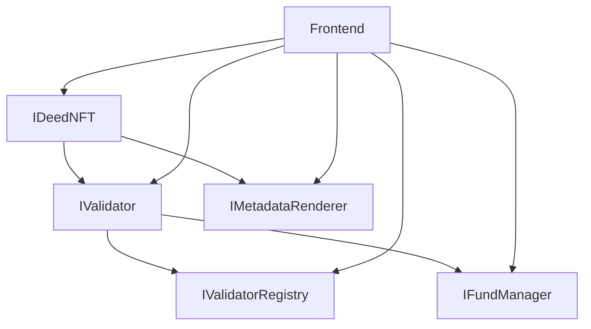

# Contract Interfaces Documentation

This document provides comprehensive documentation for all contract interfaces in The Deed Protocol, including their purpose, function signatures, and usage patterns.

## 🎯 Overview

Contract interfaces define the standard function signatures and data structures that contracts must implement. They ensure consistency, enable contract upgrades, and provide clear contracts between different components of the system.

## 📋 Interface Overview

| Interface | Purpose | Size | Key Functions |
|----------|---------|------|---------------|
| **IDeedNFT.sol** | Main NFT contract interface | 377 lines | Minting, validation, metadata management |
| **IValidator.sol** | Validator contract interface | 302 lines | Validation logic, criteria management |
| **IValidatorRegistry.sol** | Validator registry interface | 165 lines | Validator registration, discovery |
| **IMetadataRenderer.sol** | Metadata renderer interface | 256 lines | Metadata rendering, trait management |
| **IFundManager.sol** | Fund manager interface | 219 lines | Fee collection, distribution, escrow |

## 🔧 Interface Details

### 1. IDeedNFT.sol (377 lines)

The main interface for the DeedNFT contract, defining all ERC721 functionality plus protocol-specific features.

#### Core ERC721 Functions

```solidity
// Standard ERC721 functions
function ownerOf(uint256 tokenId) external view returns (address);
function transferFrom(address from, address to, uint256 tokenId) external;
function safeTransferFrom(address from, address to, uint256 tokenId) external;
function safeTransferFrom(address from, address to, uint256 tokenId, bytes memory data) external;
function approve(address to, uint256 tokenId) external;
function getApproved(uint256 tokenId) external view returns (address);
function setApprovalForAll(address operator, bool approved) external;
function isApprovedForAll(address owner, address operator) external view returns (bool);
```

#### Protocol-Specific Functions

```solidity
// Asset management
function mint(address to, uint256 assetType, string memory metadata) external;
function batchMint(address[] memory recipients, uint256[] memory assetTypes) external;

// Validation functions
function updateValidationStatus(uint256 tokenId, bool isValid, address validator) external;
function getValidationStatus(uint256 tokenId) external view returns (bool);

// Trait management
function setTrait(uint256 tokenId, bytes32 traitKey, bytes memory value, uint8 traitType) external;
function getTraitValue(uint256 tokenId, bytes32 traitKey) external view returns (bytes memory);
function getTraitKeys(uint256 tokenId) external view returns (bytes32[] memory);
function getTraitValues(uint256 tokenId, bytes32[] memory traitKeys) external view returns (bytes[] memory);
function getTraitName(bytes32 traitKey) external view returns (string memory);

// Metadata functions
function setTokenMetadata(uint256 tokenId, string memory metadata) external;
function getTokenMetadata(uint256 tokenId) external view returns (string memory);

// Role management
function hasRole(bytes32 role, address account) external view returns (bool);
function getRoleAdmin(bytes32 role) external view returns (bytes32);
function grantRole(bytes32 role, address account) external;
function revokeRole(bytes32 role, address account) external;
```

#### Events

```solidity
// Standard ERC721 events
event Transfer(address indexed from, address indexed to, uint256 indexed tokenId);
event Approval(address indexed owner, address indexed approved, uint256 indexed tokenId);
event ApprovalForAll(address indexed owner, address indexed operator, bool approved);

// Protocol-specific events
event DeedMinted(uint256 indexed tokenId, address indexed owner, uint256 assetType);
event ValidationStatusUpdated(uint256 indexed tokenId, bool isValid, address indexed validator);
event TraitUpdated(uint256 indexed tokenId, bytes32 indexed traitKey, bytes value);
event MetadataUpdated(uint256 indexed tokenId, string metadata);
```

### 2. IValidator.sol (302 lines)

Interface for the Validator contract, defining validation logic and criteria management.

#### Validation Functions

```solidity
// Core validation
function validateDeed(uint256 tokenId) external;
function updateValidationCriteria(uint256 assetType, ValidationCriteria memory criteria) external;
function getValidationCriteria(uint256 assetType) external view returns (ValidationCriteria memory);

// Document management
function setOperatingAgreement(string memory uri, string memory name) external;
function getOperatingAgreement(string memory uri) external view returns (string memory);
function setDocument(uint256 tokenId, string memory docType, string memory documentURI) external;
function getDocument(uint256 tokenId, string memory docType) external view returns (string memory);

// Fee management
function setServiceFee(address token, uint256 fee) external;
function getServiceFee(address token) external view returns (uint256);
function withdrawFees(address token, address recipient) external;
function getAccumulatedFees(address token) external view returns (uint256);
```

#### Data Structures

```solidity
struct ValidationCriteria {
    string[] requiredTraits;        // Required metadata traits
    string additionalCriteria;       // Additional validation rules
    bool requireOperatingAgreement; // Whether operating agreement is required
    bool requireDefinition;         // Whether asset definition is required
}

struct ValidatorInfo {
    string name;
    string description;
    uint256 reputation;
    uint256[] supportedAssetTypes;
    bool isActive;
}
```

#### Events

```solidity
event DeedValidated(uint256 indexed tokenId, address indexed validator, bool isValid);
event ValidationCriteriaUpdated(uint256 indexed assetType, ValidationCriteria criteria);
event OperatingAgreementSet(string indexed uri, string name);
event ServiceFeeUpdated(address indexed token, uint256 fee);
event FeesWithdrawn(address indexed token, address indexed recipient, uint256 amount);
```

### 3. IValidatorRegistry.sol (165 lines)

Interface for the ValidatorRegistry contract, defining validator registration and discovery.

#### Registration Functions

```solidity
// Validator registration
function registerValidator(address validator, string memory name, string memory description) external;
function deregisterValidator(address validator) external;
function updateValidatorInfo(address validator, string memory name, string memory description) external;

// Validator discovery
function getValidatorsForAssetType(uint256 assetType) external view returns (address[] memory);
function getValidatorInfo(address validator) external view returns (ValidatorInfo memory);
function getAllValidators() external view returns (address[] memory);

// Reputation management
function updateValidatorReputation(address validator, uint256 reputation) external;
function getValidatorReputation(address validator) external view returns (uint256);
```

#### Data Structures

```solidity
struct ValidatorInfo {
    string name;
    string description;
    uint256 reputation;
    uint256[] supportedAssetTypes;
    bool isActive;
    uint256 registrationDate;
}
```

#### Events

```solidity
event ValidatorRegistered(address indexed validator, string name, string description);
event ValidatorDeregistered(address indexed validator);
event ValidatorInfoUpdated(address indexed validator, string name, string description);
event ValidatorReputationUpdated(address indexed validator, uint256 reputation);
```

### 4. IMetadataRenderer.sol (256 lines)

Interface for the MetadataRenderer contract, defining metadata rendering and management.

#### Metadata Functions

```solidity
// Core metadata
function tokenURI(uint256 tokenId) external view returns (string memory);
function contractURI() external view returns (string memory);

// Trait synchronization
function syncTraitUpdate(uint256 tokenId, bytes32 traitKey, bytes memory traitValue) external;

// Asset management
function setTokenFeatures(uint256 tokenId, string[] memory features) external;
function getTokenFeatures(uint256 tokenId) external view returns (string[] memory);

// Condition management
function setAssetCondition(
    uint256 tokenId,
    string memory generalCondition,
    string memory lastInspectionDate,
    string[] memory knownIssues,
    string[] memory improvements,
    string memory additionalNotes
) external;

function getAssetCondition(uint256 tokenId) external view returns (
    string memory generalCondition,
    string memory lastInspectionDate,
    string[] memory knownIssues,
    string[] memory improvements,
    string memory additionalNotes
);
```

#### Document and Gallery Functions

```solidity
// Document management
function manageTokenDocument(uint256 tokenId, string memory docType, string memory documentURI, bool isRemove) external;
function getTokenDocument(uint256 tokenId, string memory docType) external view returns (string memory);
function getTokenDocuments(uint256 tokenId) external view returns (Document[] memory);

// Gallery management
function setTokenGallery(uint256 tokenId, string[] memory imageUrls) external;
function getTokenGallery(uint256 tokenId) external view returns (string[] memory);

// Animation and external links
function setTokenAnimationURL(uint256 tokenId, string memory animationURL) external;
function getTokenAnimationURL(uint256 tokenId) external view returns (string memory);
function setTokenExternalLink(uint256 tokenId, string memory externalLink) external;
function getTokenExternalLink(uint256 tokenId) external view returns (string memory);
```

#### Configuration Functions

```solidity
// Contract configuration
function setDeedNFT(address _deedNFT) external;
function setAssetTypeImageURI(uint8 assetType, string memory imageURI) external;
function setAssetTypeBackgroundColor(uint8 assetType, string memory backgroundColor) external;
function setInvalidatedImageURI(string memory imageURI) external;
```

#### Data Structures

```solidity
struct TokenMetadata {
    string name;
    string description;
    string image;
    string background_color;
    string animation_url;
    string external_link;
    string[] galleryImages;
    Document[] documents;
    string customMetadata;
}

struct Document {
    string docType;
    string documentURI;
}

struct AssetCondition {
    string generalCondition;
    string lastInspectionDate;
    string[] knownIssues;
    string[] improvements;
    string additionalNotes;
}

struct LegalInfo {
    string jurisdiction;
    string registrationNumber;
    string registrationDate;
    string[] documents;
    string[] restrictions;
    string additionalInfo;
}
```

#### Events

```solidity
event MetadataUpdate(uint256 indexed tokenId);
event MetadataSynced(uint256 indexed tokenId, bytes32 indexed traitKey, bytes value);
event TokenFeaturesUpdated(uint256 indexed tokenId, string[] features);
event AssetConditionUpdated(uint256 indexed tokenId);
event TokenDocumentUpdated(uint256 indexed tokenId, string docType, string documentURI);
event TokenGalleryUpdated(uint256 indexed tokenId, string[] imageUrls);
```

### 5. IFundManager.sol (219 lines)

Interface for the FundManager contract, defining fee collection and fund distribution.

#### Fee Management Functions

```solidity
// Fee collection
function collectFee(address token, uint256 amount) external;
function distributeFees(address token, address[] memory recipients, uint256[] memory amounts) external;
function getAccumulatedFees(address token) external view returns (uint256);

// Fee configuration
function setFeePercentage(address token, uint256 percentage) external;
function getFeePercentage(address token) external view returns (uint256);
function setFeeRecipient(address token, address recipient) external;
function getFeeRecipient(address token) external view returns (address);
```

#### Escrow Functions

```solidity
// Escrow management
function createEscrow(address token, uint256 amount, address beneficiary) external returns (uint256 escrowId);
function releaseEscrow(uint256 escrowId) external;
function getEscrowInfo(uint256 escrowId) external view returns (EscrowInfo memory);
function getEscrowsByBeneficiary(address beneficiary) external view returns (uint256[] memory);
```

#### Withdrawal Functions

```solidity
// Fund withdrawal
function withdrawFunds(address token, address recipient, uint256 amount) external;
function getAvailableFunds(address token) external view returns (uint256);
function emergencyWithdraw(address token, address recipient) external;
```

#### Data Structures

```solidity
struct EscrowInfo {
    address token;
    uint256 amount;
    address beneficiary;
    uint256 creationDate;
    bool isReleased;
    string releaseConditions;
}

struct FeeDistribution {
    address recipient;
    uint256 percentage;
    uint256 amount;
}
```

#### Events

```solidity
event FeeCollected(address indexed token, uint256 amount, address indexed payer);
event FeesDistributed(address indexed token, address[] recipients, uint256[] amounts);
event FeePercentageUpdated(address indexed token, uint256 percentage);
event FeeRecipientUpdated(address indexed token, address recipient);
event EscrowCreated(uint256 indexed escrowId, address indexed token, uint256 amount, address indexed beneficiary);
event EscrowReleased(uint256 indexed escrowId, address indexed beneficiary, uint256 amount);
event FundsWithdrawn(address indexed token, address indexed recipient, uint256 amount);
```

## 🔄 Interface Relationships

### Contract Dependencies



### Function Call Patterns

#### DeedNFT → Validator
```solidity
// DeedNFT calls Validator for validation
validator.validateDeed(tokenId);
validator.updateValidationStatus(tokenId, isValid, validator);
```

#### DeedNFT → MetadataRenderer
```solidity
// DeedNFT calls MetadataRenderer for metadata sync
metadataRenderer.syncTraitUpdate(tokenId, traitKey, traitValue);
```

#### Validator → ValidatorRegistry
```solidity
// Validator checks registry for validator info
validatorRegistry.getValidatorInfo(validator);
validatorRegistry.updateValidatorReputation(validator, reputation);
```

#### Validator → FundManager
```solidity
// Validator collects fees through FundManager
fundManager.collectFee(token, amount);
fundManager.distributeFees(token, recipients, amounts);
```

## 🔧 Implementation Guidelines

### Interface Compliance

#### Required Implementation
```solidity
contract MyContract is IDeedNFT {
    // Must implement all functions defined in IDeedNFT
    function mint(address to, uint256 assetType, string memory metadata) external override {
        // Implementation
    }
    
    // ... implement all other functions
}
```

#### Function Signatures
- Must match interface exactly
- Same parameter types and names
- Same return types
- Same visibility modifiers

#### Event Emission
```solidity
// Must emit events as defined in interface
event DeedMinted(uint256 indexed tokenId, address indexed owner, uint256 assetType);

function mint(address to, uint256 assetType, string memory metadata) external {
    // Implementation
    emit DeedMinted(tokenId, to, assetType);
}
```

### Error Handling

#### Custom Errors
```solidity
// Define custom errors for better gas efficiency
error Unauthorized();
error InvalidTokenId();
error ValidationFailed();

// Use in interface implementations
function validateDeed(uint256 tokenId) external override {
    if (!_exists(tokenId)) revert InvalidTokenId();
    if (!_hasValidatorRole(msg.sender)) revert Unauthorized();
    // Implementation
}
```

#### Return Values
```solidity
// Use consistent return patterns
function getValidationStatus(uint256 tokenId) external view override returns (bool) {
    return _validationStatus[tokenId];
}

function getTraitValue(uint256 tokenId, bytes32 traitKey) external view override returns (bytes memory) {
    return _traits[tokenId][traitKey];
}
```

## 📊 Gas Optimization

### Interface Design Patterns

#### Efficient Data Structures
```solidity
// Use packed structs for gas efficiency
struct ValidationCriteria {
    string[] requiredTraits;        // Dynamic array
    string additionalCriteria;       // String
    bool requireOperatingAgreement; // Boolean
    bool requireDefinition;         // Boolean
}
```

#### Batch Operations
```solidity
// Support batch operations for efficiency
function batchMint(address[] memory recipients, uint256[] memory assetTypes) external;
function getTraitValues(uint256 tokenId, bytes32[] memory traitKeys) external view returns (bytes[] memory);
```

#### View Functions
```solidity
// Use view functions for read-only operations
function getValidationStatus(uint256 tokenId) external view returns (bool);
function getTraitValue(uint256 tokenId, bytes32 traitKey) external view returns (bytes memory);
```

## 🔒 Security Considerations

### Access Control

#### Role-Based Permissions
```solidity
// Define clear roles in interfaces
bytes32 public constant VALIDATOR_ROLE = keccak256("VALIDATOR_ROLE");
bytes32 public constant METADATA_ROLE = keccak256("METADATA_ROLE");
bytes32 public constant ADMIN_ROLE = keccak256("ADMIN_ROLE");
```

#### Function Visibility
```solidity
// Use appropriate visibility modifiers
function mint(address to, uint256 assetType, string memory metadata) external;
function validateDeed(uint256 tokenId) external;
function setTokenMetadata(uint256 tokenId, string memory metadata) external;
```

### Input Validation

#### Parameter Validation
```solidity
// Validate inputs in interface implementations
function mint(address to, uint256 assetType, string memory metadata) external override {
    require(to != address(0), "Invalid recipient");
    require(assetType < MAX_ASSET_TYPES, "Invalid asset type");
    require(bytes(metadata).length > 0, "Empty metadata");
    // Implementation
}
```

#### State Validation
```solidity
// Validate contract state
function validateDeed(uint256 tokenId) external override {
    require(_exists(tokenId), "Token does not exist");
    require(!_isValidated[tokenId], "Already validated");
    // Implementation
}
```

## 🧪 Testing Interfaces

### Mock Implementations

#### Test Interface Compliance
```solidity
contract MockDeedNFT is IDeedNFT {
    // Implement all interface functions for testing
    mapping(uint256 => address) private _owners;
    mapping(uint256 => bool) private _validationStatus;
    
    function mint(address to, uint256 assetType, string memory metadata) external override {
        uint256 tokenId = _nextTokenId++;
        _owners[tokenId] = to;
        emit DeedMinted(tokenId, to, assetType);
    }
    
    // ... implement all other functions
}
```

#### Interface Testing
```solidity
// Test interface compliance
function testInterfaceCompliance() public {
    MockDeedNFT deedNFT = new MockDeedNFT();
    
    // Test all interface functions
    deedNFT.mint(address(1), 0, "metadata");
    bool isValid = deedNFT.getValidationStatus(1);
    // ... test all functions
}
```

## 📈 Monitoring and Events

### Event Tracking

#### Standard Events
```solidity
// All interfaces define standard events
event DeedMinted(uint256 indexed tokenId, address indexed owner, uint256 assetType);
event ValidationStatusUpdated(uint256 indexed tokenId, bool isValid, address indexed validator);
event MetadataUpdate(uint256 indexed tokenId);
```

#### Custom Events
```solidity
// Interface-specific events
event FeeCollected(address indexed token, uint256 amount, address indexed payer);
event ValidatorRegistered(address indexed validator, string name, string description);
event EscrowCreated(uint256 indexed escrowId, address indexed token, uint256 amount, address indexed beneficiary);
```

### Monitoring Metrics

#### Function Call Tracking
- Track function call frequency
- Monitor gas usage per function
- Track error rates
- Monitor performance metrics

#### Event Analysis
- Analyze event patterns
- Track user interactions
- Monitor system health
- Identify optimization opportunities

---

*This documentation is part of The Deed Protocol v0.2.0-beta. For questions about contract interfaces, please contact the development team.* 