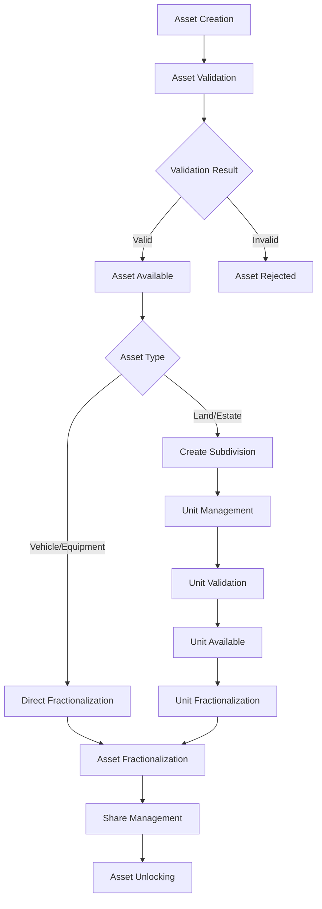
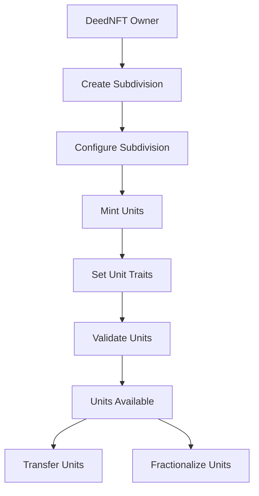
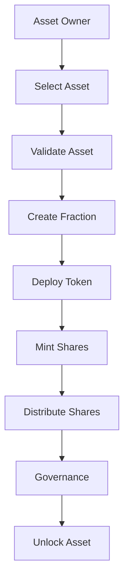
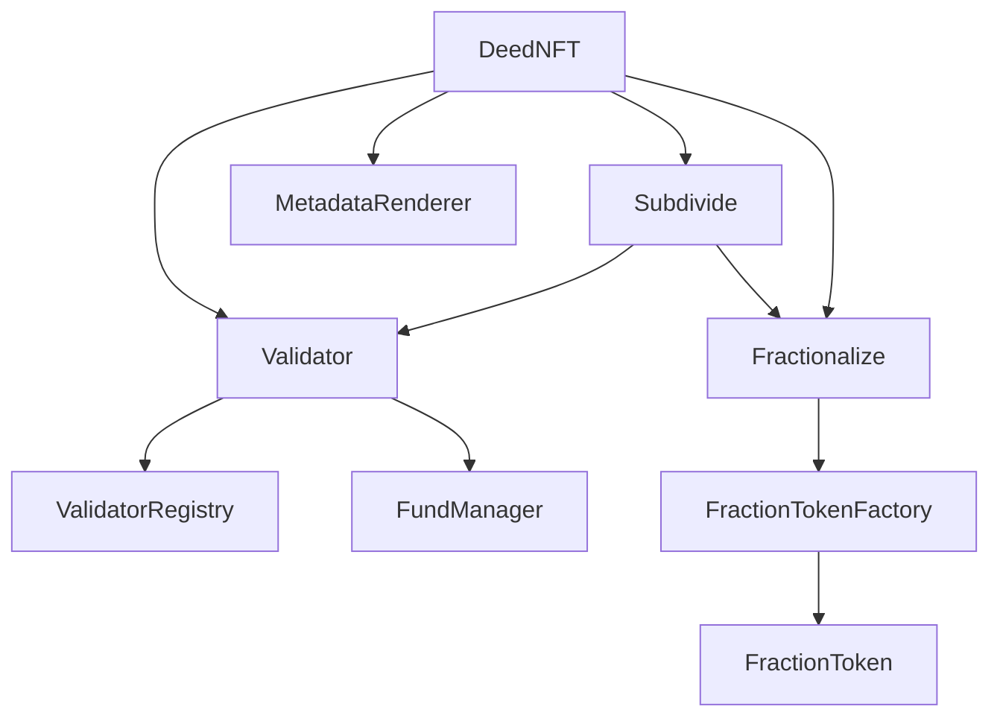

# Asset Workflows

This document outlines the complete asset lifecycle in The Deed Protocol, from initial minting through subdivision and fractionalization. It provides a comprehensive guide to understanding how assets flow through the system and the various operations available at each stage.

## 🎯 Overview

The Deed Protocol supports a complete asset lifecycle with three main stages:

1. **Asset Minting**: Create and validate DeedNFTs
2. **Asset Subdivision**: Break down assets into smaller units
3. **Asset Fractionalization**: Convert assets into tradeable shares

## 📋 Complete Asset Lifecycle

### Stage 1: Asset Minting

#### 1.1 Asset Creation

**Purpose**: Create a new DeedNFT representing a real-world asset

**Prerequisites**:
- Valid asset documentation
- Asset type identification
- Required metadata

**Process**:
1. **Asset Type Selection**
   - Land (0): Real estate properties
   - Vehicle (1): Cars, trucks, motorcycles
   - Estate (2): Buildings, structures
   - Commercial Equipment (3): Machinery, tools

2. **Metadata Configuration**
   ```solidity
   function mint(
       address to,
       uint256 assetType,
       string memory metadata
   ) external
   ```

3. **Initial Traits**
   - Asset-specific required traits
   - Custom metadata fields
   - Document references

#### 1.2 Asset Validation

**Purpose**: Verify asset authenticity and compliance

**Process**:
1. **Validator Assignment**
   - Asset assigned to appropriate validator
   - Validator reviews documentation
   - On-site inspection (if required)

2. **Validation Criteria**
   ```solidity
   function validateDeed(uint256 tokenId) external onlyRole(VALIDATOR_ROLE)
   ```

3. **Status Updates**
   - PENDING: Awaiting validation
   - VALIDATED: Successfully validated
   - REJECTED: Failed validation
   - UNDER_REVIEW: Currently being reviewed

#### 1.3 Post-Validation

**Available Operations**:
- **Transfer**: Standard ERC721 transfers
- **Metadata Updates**: Update asset information
- **Trait Management**: Add/modify asset traits
- **Subdivision**: Create subdivisions (Land/Estate only)

### Stage 2: Asset Subdivision

#### 2.1 Subdivision Creation

**Purpose**: Break down large assets into smaller, manageable units

**Prerequisites**:
- DeedNFT must be validated
- Asset type must support subdivision (Land or Estate)
- Owner must have necessary permissions

**Process**:
1. **Subdivision Planning**
   ```solidity
   function createSubdivision(
       uint256 deedId,
       string memory name,
       string memory description,
       string memory symbol,
       string memory collectionUri,
       uint256 totalUnits,
       bool burnable
   ) external
   ```

2. **Configuration**
   - Subdivision name and description
   - Trading symbol for units
   - Total number of units
   - Burning permissions
   - Collection metadata URI

#### 2.2 Unit Management

**Purpose**: Create and manage individual subdivision units

**Process**:
1. **Unit Minting**
   ```solidity
   // Single unit minting
   function mintUnit(uint256 deedId, uint256 unitId, address to) external
   
   // Batch unit minting
   function batchMintUnits(
       uint256 deedId,
       uint256[] calldata unitIds,
       address[] calldata recipients
   ) external
   ```

2. **Unit Configuration**
   - Custom metadata per unit
   - Unit-specific traits
   - Individual validation

3. **Unit Operations**
   - Transfer units (ERC1155 standard)
   - Burn units (if enabled)
   - Update unit metadata

#### 2.3 Unit Validation

**Purpose**: Validate individual subdivision units

**Process**:
1. **Validator Assignment**
   - Subdivision can have custom validator
   - Falls back to parent DeedNFT validator
   - Validator must be active in registry

2. **Unit Validation**
   ```solidity
   function validateSubdivisionUnit(
       address subdivideContract,
       uint256 deedId,
       uint256 unitId
   ) external onlyRole(VALIDATOR_ROLE)
   ```

3. **Validation Criteria**
   - Units inherit criteria from parent DeedNFT
   - Custom validation rules can be applied
   - Individual unit traits validated

#### 2.4 Post-Subdivision

**Available Operations**:
- **Unit Transfers**: Standard ERC1155 transfers
- **Unit Validation**: Individual unit validation
- **Trait Management**: Unit-specific trait updates
- **Fractionalization**: Convert units to shares

### Stage 3: Asset Fractionalization

#### 3.1 Fraction Creation

**Purpose**: Convert assets into tradeable ERC-20 shares

**Prerequisites**:
- Asset must be validated
- Asset must be owned by caller
- Asset must meet fractionalization criteria

**Process**:
1. **Asset Selection**
   - DeedNFT assets (direct fractionalization)
   - Subdivision units (unit fractionalization)

2. **Fraction Configuration**
   ```solidity
   function createFraction(FractionCreationParams calldata params) external
   ```

3. **Asset Locking**
   - Asset transferred to Fractionalize contract
   - Asset locked in secure custody
   - Original owner retains administrative rights

#### 3.2 Token Deployment

**Purpose**: Deploy ERC-20 token for fraction shares

**Process**:
1. **Factory Integration**
   ```solidity
   function createFractionToken(
       uint256 fractionId,
       string memory name,
       string memory symbol,
       uint256 maxSharesPerWallet,
       bool burnable
   ) external returns (address tokenAddress)
   ```

2. **Token Configuration**
   - Name and symbol
   - Maximum shares per wallet
   - Burning permissions
   - Access control settings

#### 3.3 Share Management

**Purpose**: Manage fraction shares and governance

**Process**:
1. **Share Minting**
   ```solidity
   function mintShares(uint256 fractionId, uint256 amount, address to) external
   function batchMintShares(BatchMintParams calldata params) external
   ```

2. **Share Operations**
   - Transfer shares (ERC-20 standard)
   - Burn shares (if enabled)
   - Vote on governance decisions

3. **Governance**
   - Approval-based unlocking
   - Voting on asset decisions
   - Administrative actions

#### 3.4 Asset Unlocking

**Purpose**: Retrieve original asset from fractionalization

**Process**:
1. **Unlock Conditions**
   - Full ownership of all shares
   - Meeting approval threshold
   - Asset integrity verification

2. **Unlock Process**
   ```solidity
   function unlockAsset(UnlockParams calldata params) external
   ```

3. **Asset Retrieval**
   - Asset transferred back to owner
   - All shares burned
   - Fraction deactivated

## 🔄 Workflow Diagrams

### Complete Asset Lifecycle



### Subdivision Workflow



### Fractionalization Workflow



## 🎯 Use Cases

### Real Estate Development

1. **Land Acquisition**
   - Mint DeedNFT for land parcel
   - Validate land ownership and zoning
   - Create subdivision for development

2. **Development Planning**
   - Subdivide land into lots
   - Set individual lot traits
   - Validate each lot separately

3. **Fractionalization**
   - Fractionalize individual lots
   - Create tradeable shares
   - Enable liquidity for investors

### Vehicle Fleet Management

1. **Fleet Registration**
   - Mint DeedNFTs for vehicles
   - Validate vehicle documentation
   - Track fleet assets

2. **Fleet Operations**
   - Transfer vehicles between operators
   - Update vehicle information
   - Monitor fleet performance

3. **Fleet Fractionalization**
   - Fractionalize high-value vehicles
   - Create investment opportunities
   - Enable fleet sharing

### Equipment Leasing

1. **Equipment Registration**
   - Mint DeedNFTs for equipment
   - Validate equipment specifications
   - Track equipment status

2. **Lease Management**
   - Transfer equipment to lessees
   - Monitor equipment usage
   - Handle maintenance records

3. **Equipment Fractionalization**
   - Fractionalize expensive equipment
   - Create investment opportunities
   - Enable equipment sharing

## 🔧 Technical Implementation

### Contract Interactions



### Data Flow

1. **Asset Creation**
   - User calls `DeedNFT.mint()`
   - DeedNFT creates NFT with initial metadata
   - Asset registered for validation

2. **Asset Validation**
   - Validator calls `Validator.validateDeed()`
   - Validation status updated in DeedNFT
   - Validation fees collected by FundManager

3. **Asset Subdivision**
   - DeedNFT owner calls `Subdivide.createSubdivision()`
   - Subdivision units minted as ERC1155 tokens
   - Units inherit traits from parent DeedNFT

4. **Asset Fractionalization**
   - Asset owner calls `Fractionalize.createFraction()`
   - Asset locked in Fractionalize contract
   - FractionToken deployed via factory

5. **Share Management**
   - Shares minted and distributed
   - Governance mechanisms activated
   - Trading enabled on exchanges

## 🚀 Best Practices

### For Asset Owners

1. **Planning**
   - Plan asset structure before minting
   - Consider subdivision and fractionalization options
   - Set clear governance rules

2. **Validation**
   - Ensure all documentation is complete
   - Work with qualified validators
   - Maintain asset information

3. **Management**
   - Monitor asset performance
   - Handle governance decisions
   - Maintain compliance

### For Validators

1. **Validation Process**
   - Apply validation criteria consistently
   - Document validation decisions
   - Maintain validation standards

2. **Performance Monitoring**
   - Track validation metrics
   - Handle disputes promptly
   - Maintain validator reputation

### For Developers

1. **Integration**
   - Implement all required interfaces
   - Handle errors gracefully
   - Optimize gas usage

2. **Testing**
   - Test all workflow scenarios
   - Verify contract interactions
   - Monitor performance

## 🔒 Security Considerations

### Asset Security

- **Ownership Verification**: Ensure proper ownership checks
- **Access Control**: Implement role-based permissions
- **Data Integrity**: Protect asset information

### Transaction Security

- **Validation Requirements**: Verify all validations
- **Approval Mechanisms**: Implement proper approval workflows
- **Audit Trails**: Maintain complete transaction history

### Governance Security

- **Multi-Signature**: Implement multi-signature requirements
- **Time Locks**: Add time delays for critical decisions
- **Threshold Settings**: Configure appropriate approval thresholds

## 📊 Performance Metrics

### Gas Optimization

| Operation | Gas Cost | Notes |
|-----------|----------|-------|
| Mint DeedNFT | ~150,000 gas | Per asset minting |
| Validate Asset | ~80,000 gas | Per asset validation |
| Create Subdivision | ~200,000 gas | One-time setup |
| Mint Unit | ~120,000 gas | Per unit minting |
| Create Fraction | ~300,000 gas | One-time setup |
| Mint Shares | ~100,000 gas | Per share minting |
| Unlock Asset | ~150,000 gas | Asset retrieval |

### Storage Efficiency

- **Optimized Data Structures**: Efficient storage patterns
- **Batch Operations**: Reduced gas costs for multiple operations
- **Lazy Loading**: On-demand data loading
- **Compression**: Data compression where applicable

## 🔄 Future Enhancements

### Planned Features

- **Automated Workflows**: AI-powered asset management
- **Multi-Asset Operations**: Handle multiple assets simultaneously
- **Real-time Monitoring**: Live tracking of all operations
- **Mobile Support**: Mobile app for asset management

### Integration Opportunities

- **DeFi Integration**: Integration with DeFi protocols
- **Marketplace Integration**: Direct integration with trading platforms
- **Legal Services**: Integration with legal document verification
- **Insurance Providers**: Automated insurance verification

---

*This documentation is part of The Deed Protocol v0.2.0-beta. For questions about asset workflows, please contact the development team.*
