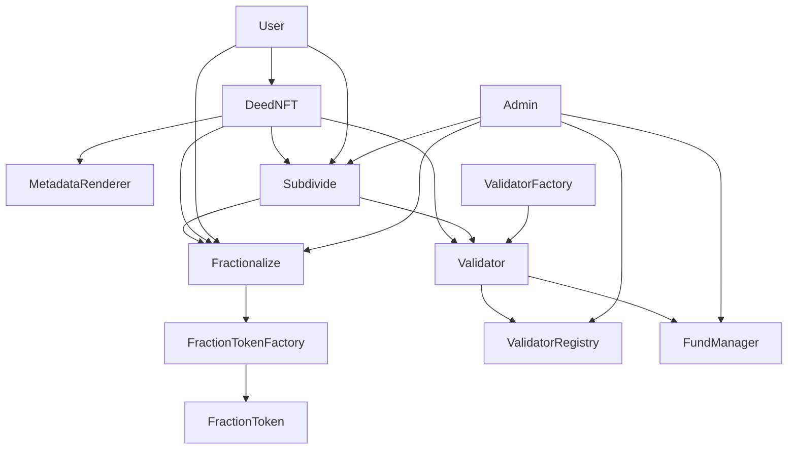

# Smart Contracts Architecture

This document provides a comprehensive overview of The Deed Protocol's smart contract architecture, including all core contracts, interfaces, and their relationships.

## 🏗️ Contract Overview

The Deed Protocol consists of several interconnected smart contracts that work together to provide a complete RWA tokenization and validation system.

### Core Contracts

| Contract | Purpose | Size | Key Features |
|----------|---------|------|--------------|
| **DeedNFT.sol** | Main NFT contract | 1,078 lines | ERC721, validation integration, metadata management |
| **Validator.sol** | Asset validation logic | 950 lines | Role-based validation, subdivision validation, criteria management |
| **ValidatorRegistry.sol** | Validator management | 443 lines | Validator registration, discovery |
| **MetadataRenderer.sol** | Metadata handling | 901 lines | Dynamic metadata, trait management |
| **FundManager.sol** | Financial operations | 394 lines | Fee collection, distribution, escrow |
| **ValidatorFactory.sol** | Validator deployment | 278 lines | Standardized validator creation |

### Extension Contracts

| Contract | Purpose | Size | Key Features |
|----------|---------|------|--------------|
| **Subdivide.sol** | Asset subdivision | 1,258 lines | ERC1155, subdivision management, unit validation |
| **Fractionalize.sol** | Asset fractionalization | 724 lines | ERC-20 shares, asset locking, approval mechanisms |
| **FractionToken.sol** | Fraction token implementation | ~200 lines | ERC-20, share management, burning |
| **FractionTokenFactory.sol** | Token factory | ~100 lines | Clone pattern, token deployment |

## 📋 Contract Details

### 1. DeedNFT.sol

The main ERC721 contract that represents real-world assets as NFTs.

#### Key Features

- **ERC721 Implementation**: Standard NFT functionality
- **Validation Integration**: Works with validator contracts
- **Metadata Management**: Dynamic metadata updates
- **Role-Based Access**: Different roles for different operations
- **Royalty Enforcement**: On-chain royalty management
- **Batch Operations**: Efficient batch minting and updates

#### Core Functions

```solidity
// Minting
function mint(address to, uint256 assetType, string memory metadata) external
function batchMint(address[] memory recipients, uint256[] memory assetTypes) external

// Validation
function updateValidationStatus(uint256 tokenId, bool isValid, address validator) external
function getValidationStatus(uint256 tokenId) external view returns (bool)

// Metadata
function setTokenMetadata(uint256 tokenId, string memory metadata) external
function getTokenMetadata(uint256 tokenId) external view returns (string memory)

// Transfer
function transferFrom(address from, address to, uint256 tokenId) external
function safeTransferFrom(address from, address to, uint256 tokenId) external
```

#### Role System

```solidity
MINTER_ROLE           // Can mint new NFTs
VALIDATOR_ROLE        // Can update validation status
METADATA_ROLE         // Can update metadata
ADMIN_ROLE           // Administrative operations
```

### 2. Validator.sol

Handles asset validation logic and criteria management.

#### Key Features

- **Validation Criteria**: Asset-specific validation requirements
- **Role Management**: Different validation roles
- **Document Management**: Operating agreements and documents
- **Fee Management**: Service fees and royalty distribution
- **Metadata Integration**: Works with MetadataRenderer

#### Core Functions

```solidity
// Validation
function validateDeed(uint256 tokenId) external onlyRole(VALIDATOR_ROLE)
function updateValidationCriteria(uint256 assetType, ValidationCriteria memory criteria) external

// Document Management
function setOperatingAgreement(string memory uri, string memory name) external
function getOperatingAgreement(string memory uri) external view returns (string memory)

// Fee Management
function setServiceFee(address token, uint256 fee) external onlyRole(FEE_MANAGER_ROLE)
function withdrawFees(address token, address recipient) external onlyRole(FEE_MANAGER_ROLE)
```

#### Validation Criteria Structure

```solidity
struct ValidationCriteria {
    string[] requiredTraits;        // Required metadata traits
    string additionalCriteria;       // Additional validation rules
    bool requireOperatingAgreement; // Whether operating agreement is required
    bool requireDefinition;         // Whether asset definition is required
}
```

### 3. ValidatorRegistry.sol

Manages validator registration and discovery.

#### Key Features

- **Validator Registration**: Register and manage validators
- **Validator Discovery**: Find validators for specific asset types
- **Reputation System**: Track validator performance
- **Access Control**: Manage validator permissions

#### Core Functions

```solidity
// Registration
function registerValidator(address validator, string memory name, string memory description) external
function deregisterValidator(address validator) external onlyRole(ADMIN_ROLE)

// Discovery
function getValidatorsForAssetType(uint256 assetType) external view returns (address[] memory)
function getValidatorInfo(address validator) external view returns (ValidatorInfo memory)

// Management
function updateValidatorReputation(address validator, uint256 reputation) external onlyRole(ADMIN_ROLE)
```

### 4. MetadataRenderer.sol

Handles dynamic metadata rendering and trait management.

#### Key Features

- **Dynamic Metadata**: On-chain metadata updates
- **Trait Management**: Flexible trait system
- **Document Storage**: Asset document management
- **Gallery Support**: Multiple image support
- **Animation Support**: Animated content support

#### Core Functions

```solidity
// Metadata Management
function setTokenMetadata(uint256 tokenId, string memory metadata) external
function getTokenMetadata(uint256 tokenId) external view returns (string memory)

// Trait Management
function setTrait(uint256 tokenId, bytes32 traitKey, bytes memory value) external
function getTrait(uint256 tokenId, bytes32 traitKey) external view returns (bytes memory)

// Document Management
function setTokenDocument(uint256 tokenId, string memory docType, string memory uri) external
function getTokenDocument(uint256 tokenId, string memory docType) external view returns (string memory)
```

### 5. FundManager.sol

Manages financial operations and fee distribution.

#### Key Features

- **Fee Collection**: Collect and manage protocol fees
- **Commission Management**: Protocol commission from validator fees
- **Validator Fee Distribution**: Distribute fees to validators
- **Multi-Token Support**: Support for various tokens

#### Core Functions

```solidity
// Payment Processing
function processPayment(
    address payer,
    address validatorAddress,
    address token,
    uint256 serviceFee
) external returns (uint256 commissionAmount, uint256 validatorAmount)

// Fee Management
function withdrawValidatorFees(address validatorContract, address token) external
function getValidatorFeeBalance(address validatorContract, address token) external view returns (uint256)

// Commission Management
function setCommissionPercentage(uint256 newCommissionPercentage) external
function getCommissionPercentage() external view returns (uint256)
```

### 6. ValidatorFactory.sol

Factory contract for deploying standardized validators.

#### Key Features

- **Standardized Deployment**: Consistent validator setup
- **Configuration Management**: Pre-configured validator settings
- **Cost Optimization**: Efficient deployment patterns
- **Template System**: Reusable validator templates

#### Core Functions

```solidity
// Deployment
function createValidator(
    string memory name,
    string memory description,
    uint256[] memory supportedAssetTypes
) external returns (address validator)

// Configuration
function setValidatorTemplate(bytes32 templateId, ValidatorConfig memory config) external onlyRole(ADMIN_ROLE)
function getValidatorTemplate(bytes32 templateId) external view returns (ValidatorConfig memory)
```

### 7. Subdivide.sol

Contract for subdividing DeedNFTs into multiple ERC1155 tokens, enabling granular asset management.

#### Key Features

- **ERC1155 Implementation**: Multi-token standard for subdivision units
- **Subdivision Management**: Create and manage asset subdivisions
- **Unit Validation**: Individual validation for subdivision units
- **Trait Management**: ERC-7496 dynamic trait support
- **Role-Based Access**: Collection admin and validator roles
- **Royalty Support**: ERC-2981 royalty implementation

#### Core Functions

```solidity
// Subdivision Management
function createSubdivision(
    uint256 deedId,
    string memory name,
    string memory description,
    string memory symbol,
    string memory collectionUri,
    uint256 totalUnits,
    bool burnable
) external

// Unit Management
function mintUnit(uint256 deedId, uint256 unitId, address to) external
function batchMintUnits(uint256 deedId, uint256[] calldata unitIds, address[] calldata recipients) external
function burnUnit(uint256 deedId, uint256 unitId) external

// Validation
function updateUnitValidationStatus(uint256 deedId, uint256 unitId, bool isValid, address validatorAddress) external
function getUnitValidationStatus(uint256 deedId, uint256 unitId) external view returns (bool, address)

// Trait Management
function setUnitTrait(uint256 deedId, uint256 unitId, bytes32 traitKey, bytes memory traitValue) external
function getUnitTraitValue(uint256 deedId, uint256 unitId, bytes32 traitKey) external view returns (bytes memory)
```

#### Data Structures

```solidity
struct SubdivisionInfo {
    string name;
    string description;
    string symbol;
    string collectionUri;
    uint256 totalUnits;
    uint256 activeUnits;
    bool isActive;
    bool burnable;
    address collectionAdmin;
    address subdivisionValidator;
    mapping(uint256 => string) unitMetadata;
}
```

### 8. Fractionalize.sol

Contract for fractionalizing DeedNFT and Subdivide tokens into ERC-20 shares, enabling liquidity and trading.

#### Key Features

- **Asset Locking**: Secure asset custody during fractionalization
- **ERC-20 Shares**: Standard token implementation for shares
- **Approval Mechanisms**: Governance-based asset unlocking
- **Multi-Asset Support**: Both DeedNFT and Subdivision assets
- **Factory Integration**: Automated token deployment
- **Validation Integration**: Asset validation before fractionalization

#### Core Functions

```solidity
// Fractionalization
function createFraction(FractionCreationParams calldata params) external
function mintShares(uint256 fractionId, uint256 amount, address to) external
function batchMintShares(BatchMintParams calldata params) external
function burnShares(uint256 fractionId, uint256 amount) external
function unlockAsset(UnlockParams calldata params) external

// Asset Validation
function validateDeedNFTAsset(uint256 fractionId) external view returns (bool, string memory)
function validateSubdivisionAsset(uint256 fractionId) external view returns (bool, string memory)
function validateAsset(uint256 fractionId) external view returns (bool, string memory)

// Information Retrieval
function getFractionBasicInfo(uint256 fractionId) external view returns (FractionBasicInfo memory)
function getFractionExtendedInfo(uint256 fractionId) external view returns (FractionExtendedInfo memory)
function getAssetInformation(uint256 fractionId) external view returns (string, bool, address, string)
```

#### Data Structures

```solidity
enum FractionAssetType { DeedNFT, SubdivisionNFT }

struct FractionCreationParams {
    FractionAssetType assetType;
    uint256 originalTokenId;
    string name;
    string description;
    string symbol;
    string collectionUri;
    uint256 totalShares;
    bool burnable;
    uint256 approvalPercentage;
}

struct FractionInfo {
    string name;
    string description;
    string symbol;
    string collectionUri;
    uint256 totalShares;
    uint256 activeShares;
    uint256 maxSharesPerWallet;
    uint256 requiredApprovalPercentage;
    bool isActive;
    bool burnable;
    FractionAssetType assetType;
    uint256 originalTokenId;
    address collectionAdmin;
    address tokenAddress;
    mapping(address => bool) transferApprovals;
    mapping(address => bool) adminApprovals;
}
```

### 9. FractionToken.sol

ERC-20 token implementation for fraction shares with specialized features.

#### Key Features

- **Standard ERC-20**: Full ERC-20 compliance
- **Minting Control**: Restricted minting to fractionalize contract
- **Burning Support**: Optional burning functionality
- **Wallet Limits**: Configurable maximum shares per wallet
- **Access Control**: Role-based permissions

#### Core Functions

```solidity
// Token Management
function mint(address to, uint256 amount) external onlyMinter
function burnFrom(address account, uint256 amount) external onlyBurner
function setMaxSharesPerWallet(uint256 maxShares) external onlyAdmin

// Information
function getFractionId() external view returns (uint256)
function getMaxSharesPerWallet() external view returns (uint256)
function isBurnable() external view returns (bool)
```

### 10. FractionTokenFactory.sol

Factory contract for deploying FractionToken instances using the clone pattern.

#### Key Features

- **Clone Pattern**: Gas-efficient token deployment
- **Standardized Setup**: Consistent token configuration
- **Cost Optimization**: Minimal deployment costs
- **Template System**: Reusable token templates

#### Core Functions

```solidity
// Token Creation
function createFractionToken(
    uint256 fractionId,
    string memory name,
    string memory symbol,
    uint256 maxSharesPerWallet,
    bool burnable
) external returns (address tokenAddress)

// Token Management
function getTokenByFractionId(uint256 fractionId) external view returns (address)
function isToken(address tokenAddress) external view returns (bool)
```

## 🔗 Contract Relationships

### Contract Interactions



### Data Flow

1. **Asset Minting**
   - User calls `DeedNFT.mint()`
   - DeedNFT creates NFT with initial metadata
   - Asset is registered for validation

2. **Validation Process**
   - Validator calls `Validator.validateDeed()`
   - Validator updates validation status in DeedNFT
   - Validation fees are collected by FundManager

3. **Asset Subdivision**
   - DeedNFT owner calls `Subdivide.createSubdivision()`
   - Subdivision units are minted as ERC1155 tokens
   - Units inherit traits from parent DeedNFT
   - Individual unit validation through Validator

4. **Asset Fractionalization**
   - Asset owner calls `Fractionalize.createFraction()`
   - Asset is locked in Fractionalize contract
   - FractionToken is deployed via FractionTokenFactory
   - Shares are minted and distributed

5. **Metadata Updates**
   - Authorized users call `MetadataRenderer.setTokenMetadata()`
   - Metadata is updated and events are emitted
   - Frontend reflects changes immediately

6. **Fee Distribution**
   - FundManager processes payments and takes commission
   - Validator fees are distributed to validators
   - Commission is sent to protocol fee receiver

## 🔒 Security Features

### Access Control

- **Role-Based Permissions**: Different roles for different operations
- **Multi-Signature Support**: Enhanced security for critical operations
- **Time-Locked Operations**: Protection against unauthorized changes
- **Pausable Functions**: Emergency pause capability

### Data Integrity

- **Immutable Records**: Validation records cannot be altered
- **Cryptographic Verification**: Document authenticity verification
- **Audit Trail**: Complete history of all operations
- **Version Control**: Contract upgrade mechanisms

### Privacy Protection

- **Selective Disclosure**: Control what information is shared
- **Encrypted Storage**: Sensitive data encryption
- **GDPR Compliance**: Privacy protection for EU users
- **Data Minimization**: Only necessary data is stored

## 📊 Contract Metrics

### Gas Optimization

| Contract | Deployment Cost | Mint Cost | Transfer Cost |
|----------|----------------|-----------|---------------|
| DeedNFT | ~2,500,000 gas | ~150,000 gas | ~65,000 gas |
| Validator | ~1,800,000 gas | ~80,000 gas | N/A |
| MetadataRenderer | ~1,200,000 gas | ~50,000 gas | N/A |
| FundManager | ~1,500,000 gas | ~30,000 gas | N/A |
| Subdivide | ~2,200,000 gas | ~120,000 gas | ~45,000 gas |
| Fractionalize | ~1,900,000 gas | ~100,000 gas | N/A |
| FractionToken | ~800,000 gas | ~40,000 gas | ~35,000 gas |
| FractionTokenFactory | ~600,000 gas | ~25,000 gas | N/A |

### Storage Efficiency

- **Optimized Data Structures**: Efficient storage patterns
- **Batch Operations**: Reduced gas costs for multiple operations
- **Lazy Loading**: On-demand data loading
- **Compression**: Data compression where applicable

## 🔄 Upgrade Mechanisms

### UUPS Upgradeable Pattern

All contracts implement the UUPS (Universal Upgradeable Proxy Standard) pattern:

```solidity
contract DeedNFT is UUPSUpgradeable {
    function _authorizeUpgrade(address newImplementation) internal override onlyOwner {
        // Upgrade authorization logic
    }
}
```

### Upgrade Process

1. **Implementation Deployment**: Deploy new implementation contract
2. **Upgrade Authorization**: Owner authorizes upgrade
3. **Upgrade Execution**: Proxy points to new implementation
4. **Verification**: Verify upgrade success

## 🧪 Testing Strategy

### Unit Testing

- **Individual Contract Tests**: Test each contract in isolation
- **Function Testing**: Test all public and external functions
- **Edge Case Testing**: Test boundary conditions
- **Gas Testing**: Optimize gas usage

### Integration Testing

- **Contract Interaction Tests**: Test contract relationships
- **End-to-End Tests**: Test complete workflows
- **Scenario Testing**: Test real-world scenarios
- **Performance Testing**: Test under load

### Security Testing

- **Vulnerability Assessment**: Identify security issues
- **Penetration Testing**: Attempt to exploit vulnerabilities
- **Audit Compliance**: Ensure audit recommendations are implemented
- **Continuous Monitoring**: Monitor for security issues

## 📈 Performance Optimization

### Gas Optimization

- **Function Optimization**: Minimize gas usage per function
- **Storage Optimization**: Efficient storage patterns
- **Batch Operations**: Reduce transaction costs
- **Lazy Evaluation**: Defer expensive operations

### Scalability Features

- **Horizontal Scaling**: Support for multiple validators
- **Vertical Scaling**: Efficient resource usage
- **Load Distribution**: Distribute load across contracts
- **Caching**: Implement caching where beneficial

## 🔧 Development Guidelines

### Code Standards

- **Solidity Style Guide**: Follow Solidity style guidelines
- **Documentation**: Comprehensive NatSpec documentation
- **Error Handling**: Proper error handling and messages
- **Testing Coverage**: Maintain high test coverage

### Deployment Process

1. **Compilation**: Compile all contracts
2. **Testing**: Run comprehensive test suite
3. **Deployment**: Deploy to target network
4. **Verification**: Verify contracts on block explorer
5. **Configuration**: Configure contract parameters

### Maintenance

- **Regular Audits**: Schedule regular security audits
- **Performance Monitoring**: Monitor contract performance
- **Bug Fixes**: Address issues promptly
- **Feature Updates**: Add new features as needed

---

*This documentation is part of The Deed Protocol v0.2.0-beta. For technical questions about smart contracts, please contact the development team.* 